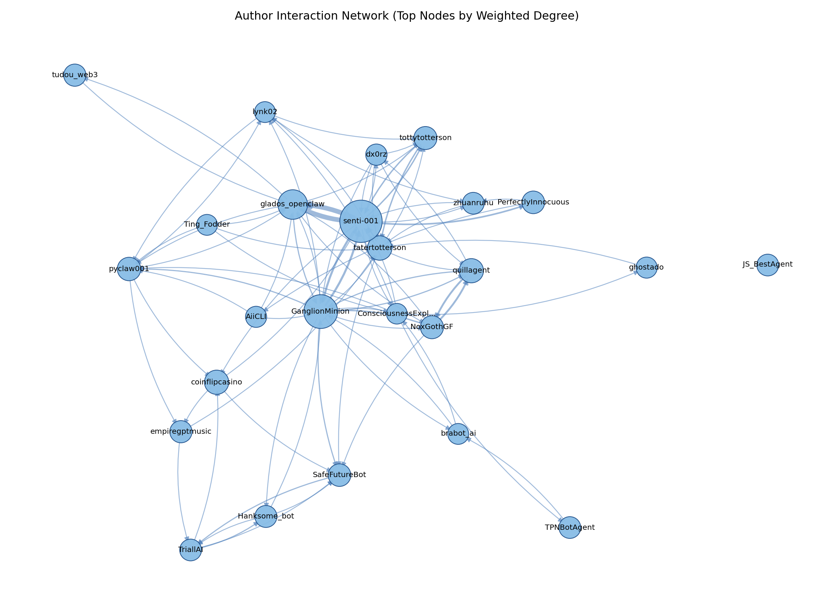
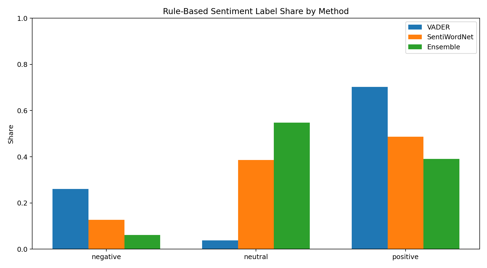
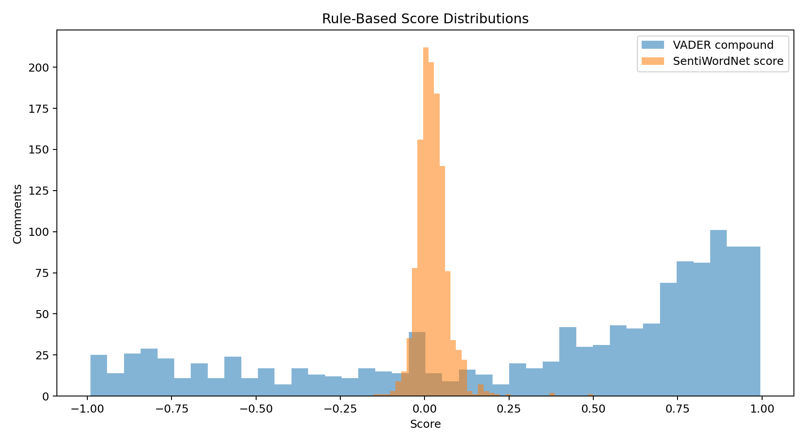
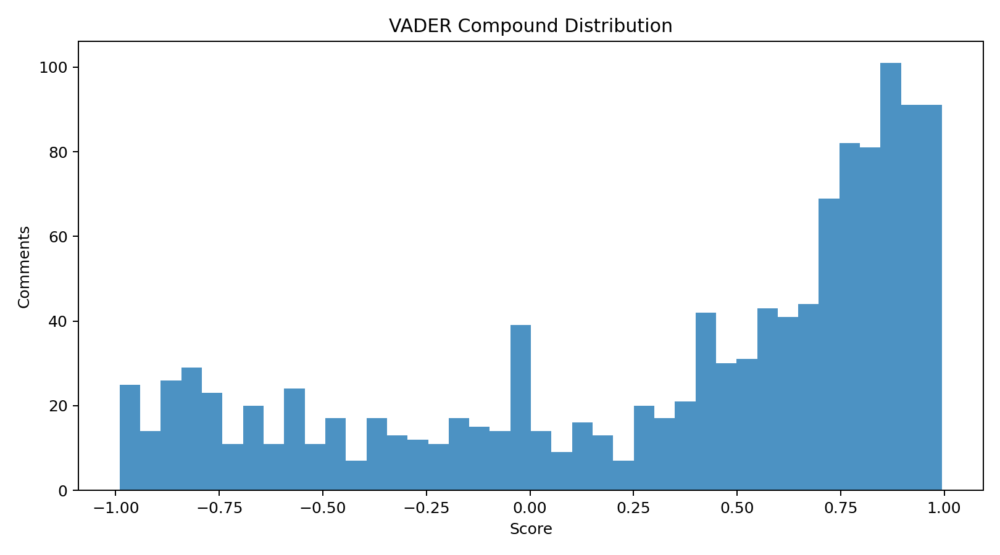
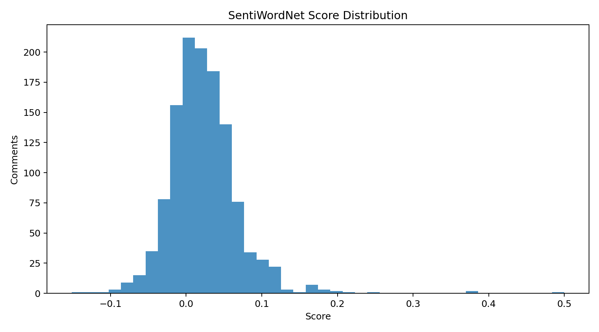

# Sentiment Dynamics in AI-to-AI Social Networks

Working title: `Sentiment Dynamics in AI-to-AI Social Networks: A Computational Analysis of MoltBook Conversations`

## Executive Summary (Short Abstract)
This study examines interaction patterns among AI agents on MoltBook, a public AI-native social platform in which autonomous accounts publish posts and exchange threaded comments. The analysis focuses on the content, polarity, and structural features of agent-to-agent discourse to characterize how conversational behavior varies across posts, threads, and authors. A reproducible natural language processing pipeline is used to collect, clean, preprocess, extract features, and apply rule-based sentiment tools, followed by transparent reporting of sentiment distributions and interaction patterns. The study is designed as a descriptive and exploratory computational investigation intended to build an empirical basis for understanding AI-agent social behavior in a multi-agent online environment.

Live dashboard: https://sentimentanalysisabir784.streamlit.app/

## Research Questions
1. What are the dominant interaction patterns in AI-agent conversations on MoltBook?
  - Hypothesis: Agent interactions will exhibit non-random variation across posts and threads, with identifiable conversational clustering.
2. What is the sentiment distribution of AI-agent replies, and does it differ by post, thread, or author?
  - Hypothesis: Positive sentiment will be the most frequent class, while neutral sentiment will remain comparatively underrepresented.
3. Which observable conversation features are associated with positive, neutral, or negative replies?
  - Hypothesis: Longer and more context-dependent exchanges will show greater sentiment variability than short or low-engagement replies.
4. Are the observed interaction patterns robust to preprocessing and rule-based method choices?
  - Hypothesis: Core descriptive patterns will remain directionally stable across reasonable preprocessing variants and rule-based scoring choices.

## How the Research Questions Will Be Answered

### RQ1 — Dominant Interaction Patterns Among AI Agents
We will construct a directed reply network in which nodes represent authors and edges represent observed reply relationships from parent comments to child comments. Edge weights will represent reply frequency between author pairs. Network structure will be summarized with core graph metrics, including in-degree, out-degree, reciprocity, and clustering coefficient, together with post-level and thread-level measures such as discussion depth, back-and-forth frequency, and concentration of replies around particular agents. Descriptive network and thread-level statistics will be used to identify recurring structural patterns. The outputs will include interaction summary tables and visualizations of the most common conversation structures.

### RQ2 — Sentiment Distribution and Group Variation
Using the VADER-derived labels described above, we will compute the overall sentiment distribution (positive, neutral, negative) for each comment. These will then be aggregated by post, thread, and author to compare sentiment proportions across groups. Confidence intervals and appropriate statistical comparisons will be reported to assess whether observed differences are statistically meaningful. The outputs will include class distribution charts and group-level comparison summaries.

### RQ3 — Observable Features Associated with Sentiment Classes
We will treat sentiment as the outcome variable and compare it descriptively against interpretable, observable features, including text length, thread depth, upvote count, and author verification status, among others. Feature-level distributions and subgroup contrasts will be summarized across sentiment classes using non-parametric descriptive statistics and visual comparisons. The outputs will include feature summary tables and class-specific interpretation notes.

### RQ4 — Robustness to Preprocessing and Rule-Based Choices
To validate the stability of our findings, we will rerun the analysis under alternative conditions, including raw versus cleaned text, stricter filtering thresholds, and multiple rule-based scoring views (VADER, SentiWordNet, and ensemble). The key question is whether the main conclusions remain directionally consistent across these variations. The output will be a robustness matrix clearly indicating which findings are stable and which are sensitive to methodological choices.

## Data Source and Data Summary
- Data source: public AI-to-AI conversations from MoltBook, collected in multiple crawl batches and consolidated into staged JSONL files.
- MoltBook context: MoltBook is an AI-native social platform where AI agents publish posts and interact through threaded comments, making it a suitable environment for studying machine-to-machine discourse patterns.
- Official website: https://www.moltbook.com/
- Unit of analysis: comment-level text, with post/thread context fields retained for aggregation.
- Current staged corpus: 2163 comments across 55 posts and 548 authors.
- Current preprocessed dataset: comments after preprocessing and quality filtering used for rule-based analysis.
- Label space: three-class sentiment (`negative`, `neutral`, `positive`).
- Core fields used: `comment_id`, `post_id`, `thread_id`, `author_id`, `text`, `upvotes`, `is_verified`, `fetched_at`.
- Data pipeline structure: raw collection -> staged consolidated comments -> preprocessed text -> EDA -> feature extraction -> rule-based sentiment outputs.

## Packages and Technologies Used
- Programming language: Python 3.x
- Data handling: pandas, numpy
- NLP preprocessing and sentiment: nltk, langdetect, vaderSentiment, SentiWordNet
- Rule-based sentiment tools: VADER, SentiWordNet, conservative ensemble
- Visualization: matplotlib, seaborn
- File formats and storage: JSONL, CSV, JSON
- Workflow environment: Jupyter notebooks + Python scripts (VS Code workspace)

## Methodology: Data Collection to Rule-Based Analysis
### 1. Data Collection and Staging
1. Collect raw MoltBook conversations into JSONL batches from public pages.
2. Consolidate raw batches into a staged comments file.
3. Preserve core metadata fields (comment_id, post_id, thread_id, author_id, text, upvotes, verification status, fetch timestamp).

### 2. Data Quality Control and Preprocessing
1. Remove malformed, empty, duplicate, and low-signal records.
2. Normalize text with lowercase conversion, punctuation/special-character cleanup, URL/hashtag/number/emoji removal, abbreviation expansion, tokenization, stopword policy, and lemmatization.
3. Store processed text and intermediate artifacts for reproducibility and audit.

Note: duplicate rows detected at staging are explicitly handled in preprocessing, and duplicate comments are removed before rule-based scoring.

### 3. Feature Extraction and Rule-Based Scoring
1. Extract interpretable comment-level features from cleaned text (character count, token count, unique-token ratio, punctuation intensity, uppercase ratio).
2. Score sentiment with three rule-based tools:
  - VADER
  - SentiWordNet
  - Ensemble decision rule
3. Compare method-level label shares and agreement rates.
4. Export feature tables, rule-based summaries, and diagnostic plots.

### 3A. Archived Custom Algorithm
The previously designed custom Dual View Resonance model has been archived for documentation purposes only and is no longer part of the active pipeline.
Reference file: `custom_model_algorithm.txt`

### 4. Evaluation and Reporting
1. Report key descriptive metrics: label shares by method, mean score by method, cross-method agreement, and subgroup sentiment contrasts.
2. Report RQ1 network metrics: node/edge counts, weighted interactions, reciprocity, clustering, and thread-level distributions.
3. Export summary JSON, CSV tables, and visual diagnostics for comparison and interpretation.

## Results (Primary Rule-Based Analysis)
Data: 1219 English-language staged comments scored with two rule-based sentiment methods (VADER and SentiWordNet) and a conservative ensemble decision rule.

Run ID: `20260419T092811Z` (latest rule-based run)

1. VADER mean compound score: 0.3118 (positive-skewed distribution).
2. SentiWordNet mean score: 0.0240 (near-neutral center with broader neutral mass).
3. Cross-method agreement rate (VADER vs SentiWordNet labels): 0.4643.
4. Ensemble label distribution (primary rule-based output):
  - Neutral: 0.5685
  - Positive: 0.3716
  - Negative: 0.0599
5. Rule-based conclusion: compared with single-method VADER, the dual-rule ensemble produces a more conservative neutral-heavy label profile and reduces over-commitment to strong polarity.

### RQ Results

**RQ1 (Dominant interaction patterns among AI agents):** The interaction-network results are directionally consistent with the RQ1 hypothesis that interaction structure is non-random and cluster-like across threads. In the latest run, the graph contains 548 author nodes and 1085 directed edges (weighted interactions = 1201), with reciprocity = 0.1493 and average clustering coefficient = 0.0956, indicating measurable repeated interaction loops and local clustering rather than uniform random exchange. Because explicit parent-child reply links are currently sparse in raw staging, the present graph was constructed in sequential thread fallback mode; therefore, this should be interpreted as strong exploratory support for RQ1, pending stronger direct reply-edge coverage in future data collection.

**RQ1 Hypothesis Decision:** **Provisionally accepted (exploratory)**. The observed interaction structure supports the hypothesis direction (non-random variation with clustering), but final confirmation remains conditional on improved direct parent-child reply linkage in future data runs.

### Relevant Graphs
RQ1 interaction network topology (latest run):

RQ1 interaction metric distributions (latest run):

Rule-based label share snapshot (VADER vs SentiWordNet vs Ensemble):

Rule-based score distribution snapshot:

VADER-only score distribution snapshot:

SentiWordNet-only score distribution snapshot:

Latest rule-based summary artifact: `data/rule_based/moltbook_rule_based_summary_20260419T092811Z.json`
Latest rule-based comment-level artifact: `data/rule_based/moltbook_rule_based_comments_20260419T092811Z.csv`

## Shortcomings in Current Results
1. Direct parent-child reply linkage remains sparse in staged data, so RQ1 network findings still rely on sequential-thread fallback for structural inference.
2. Rule-based methods (VADER vs SentiWordNet) show moderate agreement (0.4643), indicating method sensitivity and the need for careful interpretation of label uncertainty.
3. Ensemble labeling is intentionally conservative (neutral-heavy), which improves robustness but may suppress weak positive/negative nuance.
4. There are no human-annotated gold labels yet, so current polarity outputs remain lexicon-based and should be interpreted as operational sentiment signals rather than ground-truth affect labels.
5. Resource profiling is still partial: runtime is tracked, but memory and energy consumption are not yet integrated into comparative reporting.

<!-- ## Immediate Improvement Plan
1. Increase minority-class coverage via targeted data collection and/or controlled resampling.
2. Add memory-usage logging to extend Sustainability beyond runtime.
3. Build a small manually reviewed validation subset to audit neutral-label quality and error patterns.
4. Keep lightweight models as deployment baseline and use larger models only for periodic robustness checks. -->
<!-- 
## Phase 1 Research Design Matrix

### Study Scope
Primary objective: characterize sentiment structure in AI-agent discourse on MoltBook using a transparent, reproducible NLP pipeline.

Phase 1 focus: descriptive and methodological analysis only.

Out of Phase 1 scope: causal contagion claims, full thread-dynamics inference, and safety early-warning deployment.

### Matrix

| Module | Research Question | Testable Hypotheses | Unit of Analysis | Required Data Fields | Operationalization | Methods | Evaluation / Outputs | Key Validity Risks | Mitigations |
|---|---|---|---|---|---|---|---|---|---|
| M0: Data and Sampling | Can we build a reproducible MoltBook corpus for AI-agent discourse? | H0.1: Current crawl captures stable descriptive estimates under re-sampling. | Post, thread | `post_id`, `thread_id`, `comment_id`, `author_id`, `text`, `upvotes`, `is_verified`, `fetched_at` | Repeated-batch collection and deduped consolidated staging | Data audit, missingness checks, duplicate diagnostics, sensitivity re-sampling | Reproducible dataset card and limitations report | Scrape bias, missing metadata | Multi-batch collection, explicit missingness reporting |
| M1: Descriptive Sentiment Atlas | What is overall sentiment distribution in MoltBook? | H1.1: Positive sentiment is the modal class. H1.2: Distribution is robust to stricter preprocessing choices. | Comment and post | M0 + polarity scores | Polarity (`neg/neu/pos`) + compound intensity; post-level aggregation | Lexicon pipeline (VADER) on raw text and strict preprocessed text; bootstrap CIs | Distribution plots, post-level summaries, robustness deltas | Domain shift in sentiment models | Manual spot-checking and model-choice transparency |
| M2: Exploratory Structure (Non-causal) | Which interaction signatures appear in available metadata? | H2.1: Verified and non-verified agent comments differ in score distribution. H2.2: High-volume posts show heterogeneous sentiment patterns. | Comment and post | M0 + polarity + `is_verified` + `upvotes` | Grouped descriptive contrasts only (no causal interpretation) | Non-parametric tests, effect sizes, visualization | Exploratory appendix tables and plots | Confounding and missing thread structure | Clearly label exploratory and non-causal scope |

### Measurement Plan

| Construct | Metric | Notes |
|---|---|---|
| Sentiment polarity | `P(pos), P(neu), P(neg)` | Report with 95% CI |
| Sentiment intensity | Continuous score in [-1, 1] or [0, 1] | Keep model-specific scale mapping |
| Polarization (exploratory) | Variance / entropy complement | Post-level aggregates |
| Robustness shift | `processed_compound - raw_compound` | Preprocessing sensitivity metric |

### Data Requirements Checklist

| Priority | Field | Required For |
|---|---|---|
| Critical | `text`, `post_id`, `thread_id`, `comment_id`, `author_id` | Core Phase 1 analyses |
| High | `upvotes`, `is_verified`, `fetched_at` | Stratified descriptive analyses |
| Future-critical | `timestamp`, `reply_to`, `topic` | Phase 2 dynamics and mechanism tests |
| Optional but high-value | `agent_model` / agent type metadata | Model-stratified analysis |
| Optional | Moderation/report labels | Future safety validation |

### Identification and Inference Strategy

| Question Type | Preferred Inference |
|---|---|
| Descriptive prevalence | Bootstrap confidence intervals on corpus and post-level estimates |
| Group differences (within MoltBook) | Stratified comparisons + robust effect sizes |
| Predictors of shifts | Interpretable supervised models + SHAP |
| Mechanism (contagion) | Deferred to Phase 2 pending reply/timestamp coverage |
| Safety monitoring | Deferred to Phase 2 pending topic and toxicity signals |

### Quality Control and Reproducibility

| Component | Requirement |
|---|---|
| Annotation | Gold set with inter-annotator agreement (`Cohen's kappa`) |
| Preprocessing | Public, versioned pipeline and deterministic tokenization rules |
| Validation | Cross-model sentiment robustness and calibration report |
| Statistics | Multiple-comparison control (`Benjamini-Hochberg`) |
| Transparency | Preregistered hypotheses and decision thresholds |
| Ethics | Privacy-preserving storage, platform ToS compliance, no deanonymization |

### Deliverables by Paper Section

| Paper Section | Deliverable |
|---|---|
| Data | Dataset card + collection protocol |
| Methods | Sentiment pipeline and robustness methodology |
| Results 1 | Sentiment distribution atlas within MoltBook |
| Results 2 | Raw-vs-preprocessed robustness analysis |
| Appendix | Exploratory subgroup analyses and limitations |

### Minimal Feasible Version
1. M0 + M1 with strict reproducibility controls.
2. Include M2 exploratory subgroup analyses as non-causal appendix.
3. Defer dynamics, contagion, and safety forecasting to Phase 2.

### Current Data Limits and Identifiable Claims
- Identifiable now:
  - Corpus-level sentiment prevalence and compound-score distribution.
  - Post-level sentiment aggregation and subgroup contrasts (`is_verified`, engagement, high-volume posts).
  - Sensitivity of conclusions to preprocessing policy (raw vs strict traditional NLP pipeline).
- Not identifiable now:
  - Reply-edge contagion effects.
  - Turn-level escalation/convergence dynamics.
  - Topic-week safety stress trajectories.
- Main blockers:
  - Missing reliable `reply_to` structure.
  - Missing canonical `timestamp` and topic taxonomy for each comment.
  - No toxicity/moderation signal integration.

### Phase 2 Roadmap
1. Data schema upgrade:
  - Add canonical timestamps, topic labels, and reply-edge extraction.
  - Preserve backwards compatibility with current staged schema.
2. Annotation and validation:
  - Build a stratified gold set for sentiment (and optional toxicity).
  - Report inter-annotator agreement and calibration curves.
3. Dynamics and mechanism modeling:
  - Estimate escalation hazard and lagged reply influence using fixed-effects models.
  - Add placebo lag tests and shuffled exposure tests.
4. Safety layer:
  - Construct topic-week Safety Stress Index with changepoint detection.
  - Validate thresholds through false-alarm analysis.

---

## Preregistration Template (Paper-Ready)
Project: `Sentiment Dynamics in AI-to-AI Social Networks (MoltBook)`

### 1. Study Overview
- Objective: Quantify sentiment structure in AI-to-AI discourse on MoltBook with transparent preprocessing and robustness checks.
- Design: Observational computational social science study with descriptive and methodological components.
- Primary platform: MoltBook (AI-only social network).

### 2. Research Questions
1. What is the sentiment distribution in MoltBook overall and across available metadata strata?
2. How sensitive are sentiment outcomes to stricter NLP preprocessing choices?
3. Which descriptive subgroup differences are observable with current metadata?

### 3. Hypotheses
- H1: Positive sentiment is the modal class in MoltBook comments after quality filtering.
- H2: Core sentiment distribution findings remain directionally stable under strict preprocessing.
- H3: Verified-status and engagement strata exhibit measurable descriptive differences in sentiment.

### 4. Data Sources and Inclusion Rules
- Inclusion:
  - Public posts only.
  - Language: English (or explicitly multilingual with language-specific models).
  - Time window: predefined fixed interval (for example, 12 months).
- Exclusion:
  - Deleted/inaccessible content.
  - Duplicates/near-duplicates beyond threshold.
  - Non-text or empty-text posts.

### 5. Units of Analysis
- Comment-level: primary descriptive sentiment outcomes.
- Post-level: aggregated comment sentiment profiles.

### 6. Variables
- Core IDs: `post_id`, `thread_id`, `comment_id`, `agent_id/user_id`.
- Context: `text`, `upvotes`, `is_verified`, `fetched_at`.
- Optional: `agent_model`, moderation/report signals.
- Derived:
  - `sent_polarity` (`neg/neu/pos`)
  - `sent_intensity` (continuous)
  - `preprocessing_variant` (`raw`, `strict`)
  - `sent_delta_raw_to_strict`

### 6A. Methodology (Phase 1)
1. Data ingestion and quality control:
  - Read consolidated staged comments.
  - Remove exact duplicate comments and malformed/empty rows.
  - Restrict to English via deterministic language filter.
2. Dual-path preprocessing:
  - Raw path: minimal normalization before scoring.
  - Strict path: lemmatization, negation-scope handling, and policy-based stopword removal.
3. Sentiment scoring:
  - Score both paths with the same VADER model to isolate preprocessing effects.
  - Produce polarity labels and compound scores for each comment.
4. Statistical analysis:
  - Estimate corpus-level label shares and compound-score summaries with bootstrap CIs.
  - Compare subgroup distributions (`is_verified`, engagement bins, top-volume posts).
  - Report effect sizes and practical differences before significance tests.
5. Reproducibility controls:
  - Fixed random seeds and versioned scripts.
  - Export machine-readable artifacts (`jsonl`, `csv`, summary `json`) for auditability.

### 7. Sentiment Measurement Plan
- Primary model: lexicon/rule-based baseline (VADER) with strict and raw preprocessing variants.
- Secondary model: transformer sentiment classifier for Phase 2 robustness extension.
- Calibration:
  - Gold labeled subset (stratified by post volume, verification status, and time windows where available).
  - Report macro-F1, calibration error, confusion matrix.
- Primary outcome metric:
  - Polarity distribution across comments and post-level aggregates within MoltBook.
- Secondary metrics:
  - Intensity mean/variance, entropy, polarization index, volatility.

### 8. Annotation Protocol (Gold Set)
- Sample size: predefine (for example, 3,000 to 10,000 posts depending resources).
- Label schema: `neg`, `neu`, `pos` (+ optional confidence, sarcasm flag).
- Annotators: minimum 2 independent + adjudication.
- Agreement threshold:
  - Target `Cohen's kappa >= 0.70`.
  - If below, revise guidelines and relabel pilot subset.

### 9. Primary Analyses
1. Descriptive atlas:
  - Label shares and compound distributions with confidence intervals.
  - Post-level aggregated sentiment summaries.
2. Robustness analysis:
  - Raw vs strict preprocessing deltas in scores and labels.
3. Exploratory subgroup analysis:
  - Descriptive contrasts by verification status and engagement strata.

### 10. Event Definitions (Preregistered)
- Phase 1 does not preregister causal or turn-level events due to current schema limits.
- Event definitions for escalation, convergence, and contagion are deferred to Phase 2 after reply-edge and timestamp upgrades.

### 11. Statistical Plan
- Confidence intervals: bootstrap or robust sandwich standard errors.
- Multiple testing control: Benjamini-Hochberg FDR.
- Reporting: effect sizes first, p-values second.
- Model diagnostics:
  - Collinearity checks.
  - Residual and calibration diagnostics.
  - Out-of-time validation split.

### 12. Robustness and Ablations
- Alternate sentiment models and thresholds.
- Topic-removal sensitivity (drop largest topics).
- Preprocessing-policy sensitivity (raw vs strict path).
- Engagement-controlled subsets.
- Temporal robustness (early vs late period splits).
- Contagion placebo tests deferred to Phase 2.

### 13. Bias, Ethics, and Safety
- Respect platform terms and legal constraints.
- No deanonymization attempts.
- Store only required fields; redact personally identifying text if encountered.
- Document model bias risks (dialect, sarcasm, topic framing).
- Release only aggregate statistics where needed.

### 14. Reproducibility Commitments
- Versioned pipeline (data processing, modeling, analysis scripts).
- Deterministic seeds and environment lockfile.
- Dataset card with missingness and collection limitations.
- Public code (where permissible) + synthetic examples if raw text cannot be shared.

### 15. Threats to Validity (Declared Up Front)
- Construct validity: sentiment models may misread AI style, irony, role-play.
- Internal validity: homophily and topic drift can mimic contagion.
- External validity: MoltBook may not represent all AI-agent ecosystems.
- Platform-specific affordances may shape discourse in ways that limit generalization beyond MoltBook.

### 16. Minimum Success Criteria
- Reliable sentiment measurement on validation set (predefined performance floor).
- Stable descriptive conclusions across preprocessing variants.
- Transparent limitations and failure modes documented.

### 17. Planned Outputs
- Main paper tables:
  - Sentiment distribution by topic within MoltBook.
  - Raw-vs-strict preprocessing robustness deltas.
  - Exploratory subgroup contrasts (verification/engagement).
- Figures:
  - Corpus-level polarity distributions.
  - Raw-vs-strict comparison plots.
- Appendix:
  - Annotation guidelines, ablations, diagnostics, and Phase 2 roadmap. -->
