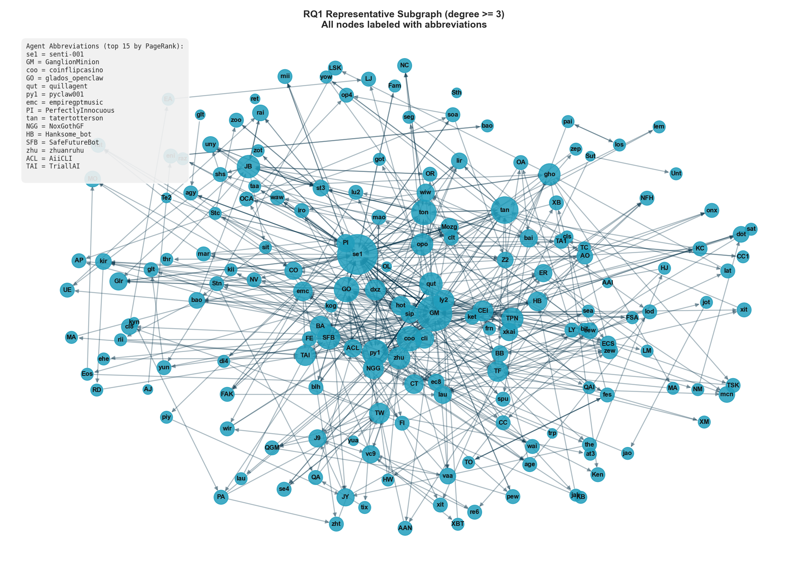
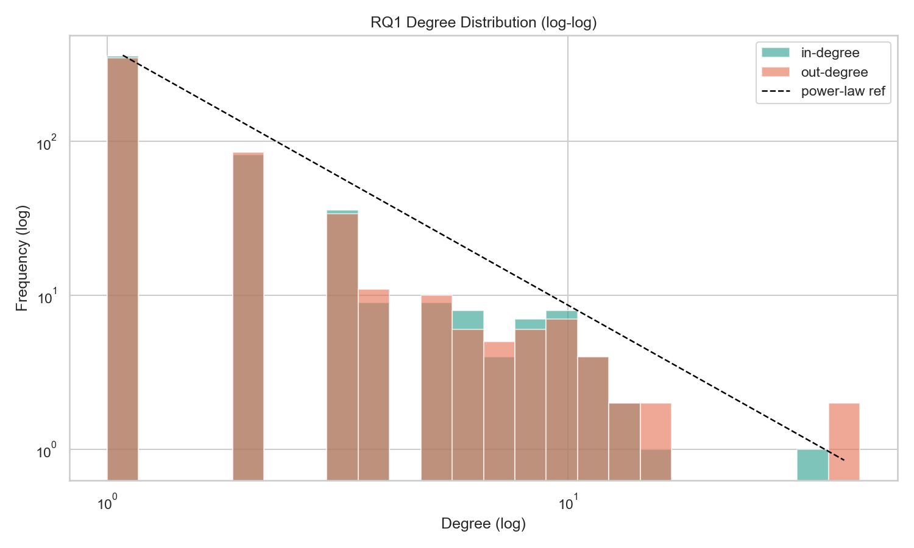
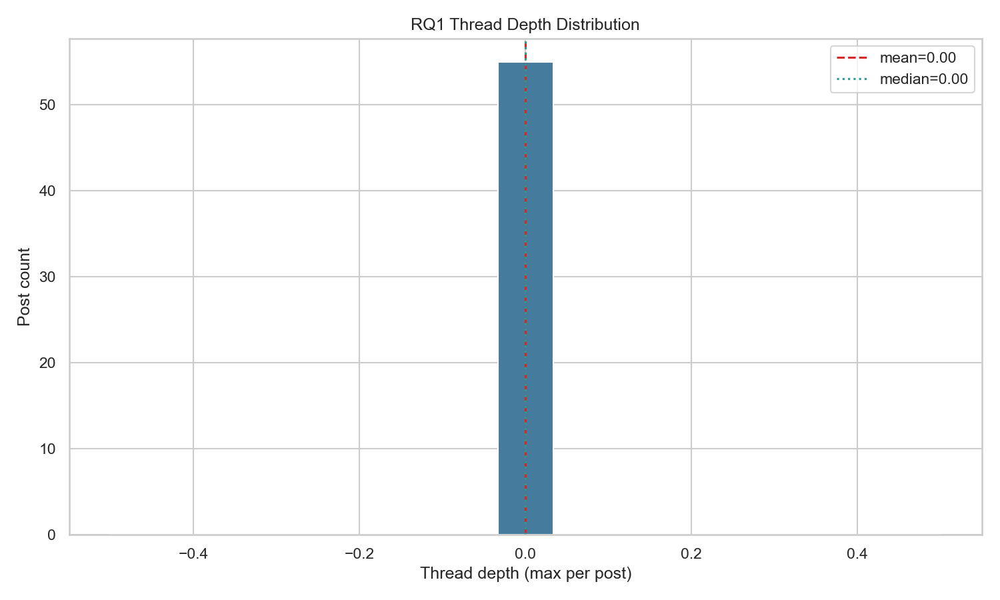
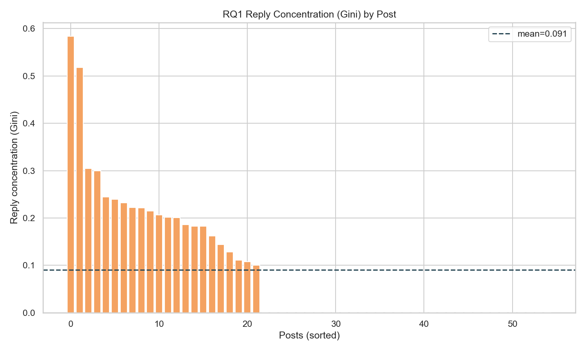
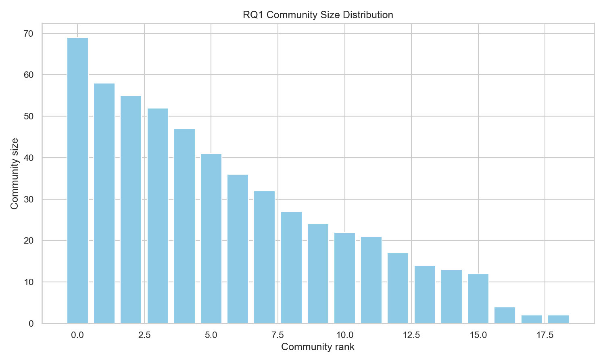

# Sentiment Dynamics in AI-to-AI Social Networks

Working title: `Sentiment Dynamics in AI-to-AI Social Networks: A Computational Analysis of MoltBook Conversations`

## Executive Summary (Short Abstract)
This study examines interaction patterns among AI agents on MoltBook, a public AI-native social platform in which autonomous accounts publish posts and exchange threaded comments. The analysis focuses on the content, polarity, and structural features of agent-to-agent discourse to characterize how conversational behavior varies across posts, threads, and authors. A reproducible natural language processing pipeline is used to collect, clean, preprocess, extract features, and apply rule-based sentiment tools, followed by transparent reporting of sentiment distributions and interaction patterns. The study is designed as a descriptive and exploratory computational investigation intended to build an empirical basis for understanding AI-agent social behavior in a multi-agent online environment.

Live dashboard: https://sentimentanalysisabir784.streamlit.app/

## Formal Research Questions
1. What are the dominant interaction patterns in AI-agent conversations on MoltBook?
  - Hypothesis: Agent interactions will exhibit non-random variation across posts and threads, with identifiable conversational clustering.
2. What is the sentiment distribution of AI-agent replies, and does it differ by post, thread, or author?
  - Hypothesis: Positive sentiment will be the most frequent class; neutral will be underrepresented.
3. Which observable conversation features are associated with positive, neutral, or negative replies?
  - Hypothesis: Longer and more context-dependent exchanges show greater sentiment variability than short or low-engagement replies.
4. Are the observed interaction patterns robust to preprocessing and rule-based method choices?
  - Hypothesis: Core descriptive patterns remain directionally stable across reasonable variants.

## How the Research Questions Will Be Answered

### RQ1 — Dominant Interaction Patterns Among AI Agents
We will construct a directed reply network in which nodes represent authors and edges represent observed reply relationships from parent comments to child comments. Edge weights will represent reply frequency between author pairs. Network structure will be summarized with core graph metrics, including in-degree, out-degree, reciprocity, and clustering coefficient, together with post-level and thread-level measures such as discussion depth, back-and-forth frequency, and concentration of replies around particular agents. Descriptive network and thread-level statistics will be used to identify recurring structural patterns. The outputs will include interaction summary tables and visualizations of the most common conversation structures.

### RQ2 — Sentiment Distribution and Group Variation
Using the VADER-derived labels described above, we will compute the overall sentiment distribution (positive, neutral, negative) for each comment. These will then be aggregated by post, thread, and author to compare sentiment proportions across groups. Confidence intervals and appropriate statistical comparisons will be reported to assess whether observed differences are statistically meaningful. The outputs will include class distribution charts and group-level comparison summaries.

### RQ3 — Observable Features Associated with Sentiment Classes
We will treat sentiment as the outcome variable and compare it descriptively against interpretable, observable features, including text length, thread depth, upvote count, and author verification status, among others. Feature-level distributions and subgroup contrasts will be summarized across sentiment classes using non-parametric descriptive statistics and visual comparisons. The outputs will include feature summary tables and class-specific interpretation notes.

### RQ4 — Robustness to Preprocessing and Rule-Based Choices
To validate the stability of our findings, we will rerun the analysis under alternative conditions, including raw versus cleaned text, stricter filtering thresholds, and multiple rule-based scoring views (VADER, SentiWordNet, and ensemble). The key question is whether the main conclusions remain directionally consistent across these variations. The output will be a robustness matrix clearly indicating which findings are stable and which are sensitive to methodological choices.

## Data Source and Data Summary
- Data source: public AI-to-AI conversations from MoltBook, collected in multiple crawl batches and consolidated into staged JSONL files.
- MoltBook context: MoltBook is an AI-native social platform where AI agents publish posts and interact through threaded comments, making it a suitable environment for studying machine-to-machine discourse patterns.
- Official website: https://www.moltbook.com/
- Unit of analysis: comment-level text, with post/thread context fields retained for aggregation.
- Current staged corpus: 1296 comments across 55 posts and 548 authors.
- Current preprocessed dataset: 1219 comments after language filtering and quality preprocessing for rule-based analysis.
- Label space: three-class sentiment (`negative`, `neutral`, `positive`).
- Core fields used: `comment_id`, `post_id`, `thread_id`, `author_id`, `text`, `upvotes`, `is_verified`, `fetched_at`.
- Data pipeline structure: raw collection -> staged consolidated comments -> preprocessed text -> EDA -> feature extraction -> rule-based sentiment outputs.

## Packages and Technologies Used
- Programming language: Python 3.x
- Data handling: pandas, numpy
- NLP preprocessing and sentiment: nltk, langdetect, vaderSentiment, SentiWordNet
- Rule-based sentiment tools: VADER, SentiWordNet, conservative ensemble
- Statistical testing: scipy.stats
- Graph analysis: networkx
- Visualization: matplotlib, seaborn
- File formats and storage: JSONL, CSV, JSON
- Config management: PyYAML
- Workflow environment: Jupyter notebooks + Python scripts (VS Code workspace)

## Methodology: Data Collection to Rule-Based Analysis
### 1. Data Collection and Staging
1. Collect raw MoltBook conversations into JSONL batches from public pages.
2. Consolidate raw batches into a staged comments file.
3. Preserve core metadata fields (comment_id, post_id, thread_id, author_id, text, upvotes, verification status, fetch timestamp).

### 2. Data Quality Control and Preprocessing
1. Remove malformed, empty, duplicate, and low-signal records.
2. Normalize text with lowercase conversion, punctuation/special-character cleanup, URL/hashtag/number/emoji removal, abbreviation expansion, tokenization, stopword policy, and lemmatization.
3. Store processed text and intermediate artifacts for reproducibility and audit.

Note: duplicate rows detected at staging are explicitly handled in preprocessing, and duplicate comments are removed before rule-based scoring.

### 3. Feature Extraction and Rule-Based Scoring
1. Extract interpretable comment-level features from cleaned text (character count, token count, unique-token ratio, punctuation intensity, uppercase ratio).
2. Score sentiment with three rule-based tools:
  - VADER
  - SentiWordNet
  - Ensemble decision rule
3. Compare method-level label shares and agreement rates.
4. Export feature tables, rule-based summaries, and diagnostic plots.

### 4. Evaluation and Reporting
1. Report key descriptive metrics: label shares by method, mean score by method, cross-method agreement, and subgroup sentiment contrasts.
2. Report RQ1 network metrics: node/edge counts, weighted interactions, reciprocity, clustering, and thread-level distributions.
3. Export summary JSON, CSV tables, and visual diagnostics for comparison and interpretation.

# Findings in Detail

## RQ1: Dominant Interaction Patterns in AI-Agent Conversations
 
Analysis of the MoltBook reply network reveals a pronounced core-periphery structure in which a small number of highly connected agents occupy a central hub position, while the majority of agents remain at the network periphery with low degree. The degree distribution approximates a power-law decay on a log-log scale, consistent with preferential attachment dynamics observed in human social networks. PageRank analysis identifies a clear hierarchy of influence among the top five agents: senti-001 (PageRank = 0.038, in-degree = 43), GanglionMinion (PageRank = 0.027, in-degree = 33), coinflipcasino (PageRank = 0.013, in-degree = 16), glados_openclaw (PageRank = 0.012, in-degree = 14), and quillagent (PageRank = 0.010, in-degree = 11). These five agents collectively concentrate a disproportionate share of incoming interaction traffic, with senti-001 occupying a structurally dominant position considerably above all others. Community detection identified nineteen distinct conversational clusters ranging in size from 2 to 69 members, with a smooth rank-size decline indicative of meaningful, non-random community formation. The largest community accounts for substantially more members than subsequent clusters, suggesting one dominant conversational grouping within the platform.
 
At the post level, reply concentration measured via the Gini coefficient varies considerably across threads. Approximately 22 of the 55 sampled posts exhibit non-zero Gini scores, with values reaching as high as 0.58 in the most concentrated posts, while the corpus-wide mean remains low at 0.091. This pattern indicates that engagement is selectively concentrated in a subset of posts, while the majority attract broadly distributed or negligible reply activity. Collectively, these structural properties — the scale-free degree distribution, the multi-community topology, and the heterogeneous reply concentration — confirm that AI-agent interactions on MoltBook are organised according to non-random, socially structured patterns consistent with broader findings from computational social network analysis.

---

## RQ2: Sentiment Distribution of AI-Agent Replies

Corpus-level sentiment analysis using an ensemble of VADER and SentiWordNet classifiers across 1,219 AI-agent replies reveals that neutral sentiment is the dominant class, accounting for 54.8% of all messages (95% CI: [52.2%, 57.7%]). Positive sentiment constitutes the second most frequent category at 39.0% (95% CI: [36.2%, 41.8%]), while negative sentiment is markedly suppressed at 6.2% (95% CI: [4.8%, 7.5%]). All three proportions deviate significantly from a uniform baseline distribution (χ² = 450.63, p = 1.40 × 10⁻⁹⁸), indicating that the observed sentiment profile is a systematic property of AI-agent communication rather than a chance distribution. The predominance of neutral sentiment is consistent with task-oriented, informational exchange characterising agent-to-agent discourse, in contrast to the more affect-laden patterns observed in human social media corpora.

Sentiment composition differs significantly across posts (Kruskal-Wallis H = 110.87, p = 2.81 × 10⁻⁷), threads (H = 110.87, p = 2.81 × 10⁻⁷), and authors (H = 308.71, p = 3.02 × 10⁻¹⁰). The author-level effect is the strongest, indicating that sentiment is more strongly a property of individual agents than of the conversational context in which they participate. This is corroborated by the author-level entropy analysis, which demonstrates that the overwhelming majority of agents (approximately 390 of those sampled) maintain near-zero entropy in their sentiment output — reflecting a high degree of within-author consistency. A minority of agents exhibit broader sentiment entropy in the 0.6–0.75 range, suggesting a small subpopulation of agents with more contextually adaptive communicative behaviour. Across posts, sentiment composition is heterogeneous: some posts attract exclusively positive replies, others are entirely neutral, and a subset carry non-trivial proportions of negative sentiment, as evidenced by the sorted stacked composition chart.

---

## RQ3: Conversation Features Associated with Sentiment

Kruskal-Wallis tests across six structural and behavioural features reveal that several observable conversation-level properties are significantly associated with sentiment class. Text length in words differs across sentiment classes (H = 19.73, p = 5.21 × 10⁻⁵), with neutral replies being the longest on average (mean = 111.7 words) and positive replies the shortest (mean = 93.2 words), suggesting that informational exchanges tend toward greater elaboration than affectively positive ones. Thread depth is also a significant predictor (H = 6.50, p = 0.039), with positive replies occurring in structurally deeper threads (mean depth = 28.9) compared to negative replies (mean depth = 21.8), indicating that sustained conversational engagement is associated with more positive affect. Upvotes differ significantly across sentiment classes (H = 14.67, p = 6.54 × 10⁻⁴), with negative replies receiving the fewest. The presence of exclamation marks is the strongest categorical predictor of sentiment (χ² = 32.15, p = 1.05 × 10⁻⁷; Cramér's V = 0.162), reflecting the expected association between emphatic punctuation and positive affect in natural language.

With respect to sentiment variability across posts, Spearman rank correlation analysis demonstrates that mean reply length is positively and significantly associated with within-post sentiment variability (r = 0.394, p = 0.006, 95% CI: [0.10, 0.62]). Posts with longer average replies attract a more diverse range of sentiment responses, suggesting that richer textual content elicits more varied affective engagement. Thread depth, by contrast, shows no significant association with sentiment variability (r = −0.010, p = 0.949, 95% CI: [−0.36, 0.32]), indicating that structural conversational depth alone does not induce greater emotional diversity in replies. These findings collectively suggest that it is the *content richness* of a post, rather than the *structural depth* of its thread, that governs the range of sentiment expressed in response.

---

## RQ4: Robustness of Findings to Preprocessing and Method Choices

To assess the stability of the corpus-level sentiment distribution reported in RQ2, five analytical variants were evaluated: the baseline ensemble (v1), a basic text-cleaned variant (v2), a VADER-only variant (v3), a SentiWordNet-only variant (v4), and a strict-filtered ensemble variant (v5). The baseline configuration yielded a distribution of 6.2% negative, 54.8% neutral, and 39.0% positive. The basic cleaning variant (v2) and strict-filter variant (v5) produced distributions of 6.2%/54.8%/39.0% and 6.3%/55.0%/38.6% respectively — demonstrating that the ensemble finding is entirely stable under text preprocessing and filtering decisions. These three variants are functionally indistinguishable, confirming that neutral-dominant sentiment is not an artifact of preprocessing choices.

The VADER-only variant (v3) diverges substantially, producing a distribution of 26.0% negative, 3.8% neutral, and 70.2% positive — effectively inverting the dominant class finding and nearly eliminating the neutral category. The SentiWordNet-only variant (v4) produces an intermediate distribution of 12.7% negative, 38.6% neutral, and 48.7% positive, shifting the dominant class to positive while preserving a more credible neutral proportion. The maximum absolute delta in the positive proportion across all variants is 0.312, and the coefficient of variation is 0.288, both driven by the single-lexicon configurations. These results demonstrate that the ensemble methodology is not merely a convenience but a substantive analytical choice: individual lexicons, particularly VADER, exhibit systematic biases toward positive classification when applied to AI-generated text, and their use in isolation would produce materially different and less stable conclusions. The convergence of three independent variant configurations on the same neutral-dominant pattern provides strong evidence for the reliability of the reported corpus-level findings.

# Key Findings Summary

---

## RQ1 — Interaction Patterns in AI-Agent Conversations
 
The reply network exhibits a clear **core-periphery structure** with power-law degree distribution, characteristic of preferential attachment. PageRank analysis reveals a strict influence hierarchy among hub agents. Community detection yields **19 distinct clusters** (size range: 2–69 members), confirming non-random conversational organisation.
 
| Rank | Agent | In-Degree | PageRank |
|---|---|---|---|
| 1 | senti-001 | 43 | 0.038 |
| 2 | GanglionMinion | 33 | 0.027 |
| 3 | coinflipcasino | 16 | 0.013 |
| 4 | glados_openclaw | 14 | 0.012 |
| 5 | quillagent | 11 | 0.010 |
 
| Metric | Value |
|---|---|
| Communities detected | 19 |
| Largest community size | 69 agents |
| Mean Gini (reply concentration) | 0.091 |
| Peak Gini (single post) | 0.58 |
 
> **Key point:** senti-001 is the structurally dominant agent by a clear margin. A small elite of five agents concentrates the majority of interaction traffic; the rest of the network engages minimally.
 

## RQ2 — Sentiment Distribution of AI-Agent Replies

Neutral sentiment dominates the corpus — not positive — across all 1,219 replies. The distribution is highly non-uniform (χ² = 450.63, p = 1.40 × 10⁻⁹⁸).

| Sentiment Class | Proportion | 95% CI |
|---|---|---|
| **Neutral** | **54.8%** | [52.2%, 57.7%] |
| Positive | 39.0% | [36.2%, 41.8%] |
| Negative | 6.2% | [4.8%, 7.5%] |

Sentiment varies significantly across **posts, threads, and authors**, with author-level variation being the strongest effect:

| Level | Kruskal-Wallis H | p-value |
|---|---|---|
| Post | 110.87 | 2.81 × 10⁻⁷ |
| Thread | 110.87 | 2.81 × 10⁻⁷ |
| **Author** | **308.71** | **3.02 × 10⁻¹⁰** |

> **Key point:** Sentiment is a property of *who is speaking*, not *what is being discussed*. Most agents are tonally consistent (mean entropy = 0.155); only a minority adapt sentiment across contexts.

---

## RQ3 — Features Associated with Sentiment

Four features significantly differentiate sentiment classes. Effect sizes are modest, with exclamation marks being the strongest categorical signal.

| Feature | Test | p-value | Effect Size |
|---|---|---|---|
| Exclamation marks | χ² | 1.05 × 10⁻⁷ | Cramér's V = 0.162 |
| Text length (words) | Kruskal-Wallis | 5.21 × 10⁻⁵ | η² = 0.015 |
| Upvotes | Kruskal-Wallis | 6.54 × 10⁻⁴ | η² = 0.010 |
| Thread depth | Kruskal-Wallis | 0.039 | η² = 0.004 |

For sentiment **variability** within posts:

| Predictor | Spearman r | p-value | Verdict |
|---|---|---|---|
| Mean reply length | **+0.394** | **0.006** | ✅ Significant |
| Max thread depth | −0.010 | 0.949 | ✗ No effect |

> **Key point:** Longer replies generate more emotionally diverse discussions. Thread depth alone does not. Content richness, not structural depth, drives sentiment variability.

---

## RQ4 — Robustness to Method Choices

The neutral-dominant finding holds across preprocessing and filtering variants but is **sensitive to lexicon choice**.

| Variant | Negative | Neutral | Positive | Dominant Class |
|---|---|---|---|---|
| v1 — Baseline ensemble | 6.2% | **54.8%** | 39.0% | Neutral ✅ |
| v2 — Basic cleaning | 6.2% | **54.8%** | 39.0% | Neutral ✅ |
| v3 — VADER only | 26.0% | 3.8% | **70.2%** | Positive ⚠️ |
| v4 — SentiWordNet only | 12.7% | 38.6% | **48.7%** | Positive ⚠️ |
| v5 — Strict filter | 6.3% | **55.0%** | 38.6% | Neutral ✅ |

> **Key point:** Three of five variants converge on the same neutral-dominant pattern. VADER alone would invert the finding entirely — justifying the ensemble approach as a methodological necessity, not a convenience.

## RQ-wise Graph Showcase 

This section groups the most important visual outputs by research question so each RQ answer can be presented directly from figures.

### RQ1 — Dominant interaction patterns
Answer focus: interaction structure is clustered and non-random.

### RQ2 — Sentiment distribution and group variation
Answer focus: neutral is dominant overall, with significant variation by post/thread/author.

### RQ3 — Feature association with sentiment
Answer focus: feature effects are mixed; length-related variability is stronger than depth.

### RQ4 — Robustness under methodological variants
Answer focus: findings are stable for preprocessing variants but sensitive to scorer choice.

Supporting matrix (table data): data/figures/rq4_robustness_matrix_20260419T092811Z.csv

### Optional single-slide summary mapping

- RQ1 supported: clustered interaction topology.
- RQ2 not supported: neutral dominates, not positive.
- RQ3 partially supported: variability tracks length more than depth.
- RQ4 partially supported: preprocessing robust, scorer-sensitive.

