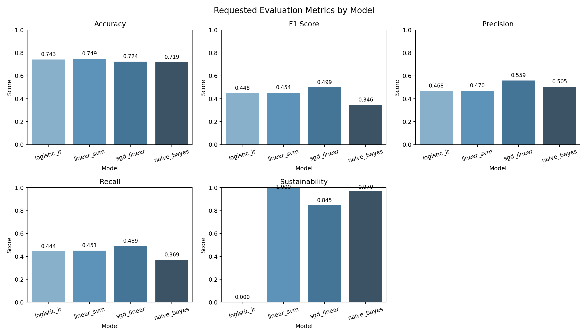
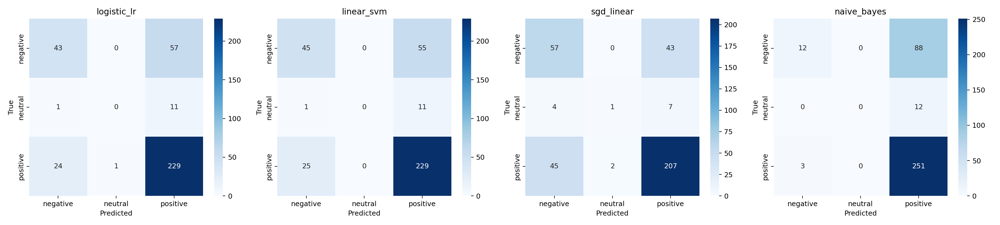
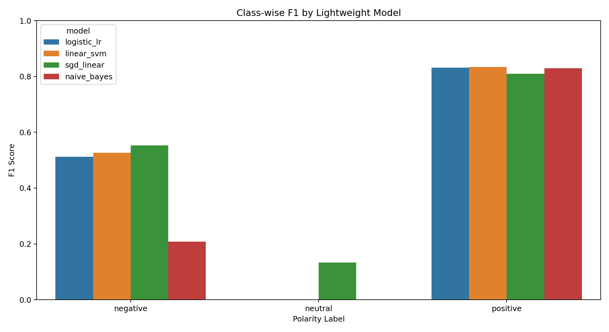

# Sentiment Dynamics in AI-to-AI Social Networks

Working title: `Sentiment Dynamics in AI-to-AI Social Networks: A Computational Analysis of MoltBook Conversations`

## Executive Summary (Short Abstract)
This project builds a reproducible sentiment analysis pipeline for AI-to-AI social interaction data from MoltBook. The goal is to characterize polarity patterns (negative, neutral, positive), test how robust findings are to preprocessing choices, and benchmark lightweight machine learning models that can run on constrained hardware. The workflow covers data collection, cleaning, preprocessing, feature extraction, cross-validated model training, and transparent reporting with visual diagnostics. Current results show stable overall accuracy in the low-to-mid 0.70 range, but weaker performance for minority classes (especially neutral), indicating that class imbalance remains a key methodological challenge for Phase 1.

## Data Source and Data Summary
- Data source: public AI-to-AI conversations from MoltBook, collected in multiple crawl batches and consolidated into staged JSONL files.
- Unit of analysis: comment-level text, with post/thread context fields retained for aggregation.
- Current modeling dataset: 366 labeled comments after preprocessing and quality filtering.
- Label space: three-class sentiment (`negative`, `neutral`, `positive`).
- Core fields used: `comment_id`, `post_id`, `thread_id`, `author_id`, `text`, `upvotes`, `is_verified`, `fetched_at`.
- Data pipeline structure: raw collection -> staged consolidated comments -> preprocessed text -> polarity and training-ready CSV artifacts.

## Packages and Technologies Used
- Programming language: Python 3.x
- Data handling: pandas, numpy
- NLP preprocessing and sentiment: nltk, langdetect, vaderSentiment
- ML modeling (lightweight): scikit-learn
  - TF-IDF features: `TfidfVectorizer`
  - Models: Logistic Regression, Linear SVM, SGDClassifier, Multinomial Naive Bayes
  - Validation: StratifiedKFold, CalibratedClassifierCV
- Visualization: matplotlib, seaborn
- File formats and storage: JSONL, CSV, JSON
- Workflow environment: Jupyter notebooks + Python scripts (VS Code workspace)

## Methodology: Data Collection to Model Training
### 1. Data Collection and Staging
1. Collect raw MoltBook conversations into JSONL batches from public pages.
2. Consolidate raw batches into a staged comments file.
3. Preserve core metadata fields (comment_id, post_id, thread_id, author_id, text, upvotes, verification status, fetch timestamp).

### 2. Data Quality Control and Preprocessing
1. Remove malformed, empty, duplicate, and low-signal records.
2. Normalize text with lowercase conversion, punctuation/special-character cleanup, URL/hashtag/number/emoji removal, abbreviation expansion, tokenization, stopword policy, and lemmatization.
3. Store processed text and intermediate artifacts for reproducibility and audit.

### 3. Label Construction
1. Generate sentiment-oriented target labels from processed polarity outputs.
2. Use the training-ready CSV as the modeling input dataset.
3. Keep labels in three classes: negative, neutral, positive.

### 4. Feature Engineering and Modeling
1. Transform text to TF-IDF features (unigram + bigram).
2. Train lightweight models suitable for local devices:
  - Logistic Regression (calibrated)
  - Linear SVM
  - SGD linear classifier
  - Multinomial Naive Bayes
3. Use stratified 5-fold cross-validation for robust estimates.
4. Apply minority-threshold tuning for probabilistic models to improve sensitivity on underrepresented classes.

### 5. Evaluation and Reporting
1. Report five key metrics: Accuracy, F1 Score (macro), Precision (macro), Recall (macro), Sustainability.
2. Define Sustainability as a runtime-efficiency indicator normalized to [0, 1], where higher means faster and more device-friendly.
3. Export prediction tables, summary JSON, and visual diagnostics for comparison and interpretation.

## Results (Current Run)
Data: 366 labeled comments, 5-fold stratified cross-validation.

1. Best Accuracy: Linear SVM (0.7486)
2. Best Macro F1: SGD linear model (0.4990)
3. Best Sustainability: Linear SVM (1.0000)
4. Strongest overall balance (performance + efficiency): Linear SVM and SGD linear

### Model Results Table

| Model | Accuracy | F1 Score (Macro) | Precision (Macro) | Recall (Macro) | Sustainability |
|---|---:|---:|---:|---:|---:|
| Logistic Regression (calibrated) | 0.7432 | 0.4477 | 0.4678 | 0.4439 | 0.0000 |
| Linear SVM | 0.7486 | 0.4535 | 0.4700 | 0.4505 | 1.0000 |
| SGD Linear | 0.7240 | 0.4990 | 0.5588 | 0.4894 | 0.8451 |
| Multinomial Naive Bayes | 0.7186 | 0.3461 | 0.5050 | 0.3694 | 0.9703 |

### Relevant Graphs
Requested metrics dashboard (Accuracy, F1, Precision, Recall, Sustainability):

Confusion matrices across models:

Class-wise F1 comparison:

## Shortcomings in Current Results
1. Neutral class performance is still weak because class support is low relative to positive samples.
2. Accuracy is acceptable, but macro-level metrics show imbalance sensitivity and limited minority recall.
3. Lexical TF-IDF features can miss nuanced pragmatic meaning in AI-agent dialog (irony, role-play, intent shifts).
4. Current Sustainability score is runtime-based only; it does not yet include memory footprint and energy measurements.

<!-- ## Immediate Improvement Plan
1. Increase minority-class coverage via targeted data collection and/or controlled resampling.
2. Add memory-usage logging to extend Sustainability beyond runtime.
3. Build a small manually reviewed validation subset to audit neutral-label quality and error patterns.
4. Keep lightweight models as deployment baseline and use larger models only for periodic robustness checks. -->
<!-- 
## Phase 1 Research Design Matrix

### Study Scope
Primary objective: characterize sentiment structure in AI-agent discourse on MoltBook using a transparent, reproducible NLP pipeline.

Phase 1 focus: descriptive and methodological analysis only.

Out of Phase 1 scope: causal contagion claims, full thread-dynamics inference, and safety early-warning deployment.

### Matrix

| Module | Research Question | Testable Hypotheses | Unit of Analysis | Required Data Fields | Operationalization | Methods | Evaluation / Outputs | Key Validity Risks | Mitigations |
|---|---|---|---|---|---|---|---|---|---|
| M0: Data and Sampling | Can we build a reproducible MoltBook corpus for AI-agent discourse? | H0.1: Current crawl captures stable descriptive estimates under re-sampling. | Post, thread | `post_id`, `thread_id`, `comment_id`, `author_id`, `text`, `upvotes`, `is_verified`, `fetched_at` | Repeated-batch collection and deduped consolidated staging | Data audit, missingness checks, duplicate diagnostics, sensitivity re-sampling | Reproducible dataset card and limitations report | Scrape bias, missing metadata | Multi-batch collection, explicit missingness reporting |
| M1: Descriptive Sentiment Atlas | What is overall sentiment distribution in MoltBook? | H1.1: Positive sentiment is the modal class. H1.2: Distribution is robust to stricter preprocessing choices. | Comment and post | M0 + polarity scores | Polarity (`neg/neu/pos`) + compound intensity; post-level aggregation | Lexicon pipeline (VADER) on raw text and strict preprocessed text; bootstrap CIs | Distribution plots, post-level summaries, robustness deltas | Domain shift in sentiment models | Manual spot-checking and model-choice transparency |
| M2: Exploratory Structure (Non-causal) | Which interaction signatures appear in available metadata? | H2.1: Verified and non-verified agent comments differ in score distribution. H2.2: High-volume posts show heterogeneous sentiment patterns. | Comment and post | M0 + polarity + `is_verified` + `upvotes` | Grouped descriptive contrasts only (no causal interpretation) | Non-parametric tests, effect sizes, visualization | Exploratory appendix tables and plots | Confounding and missing thread structure | Clearly label exploratory and non-causal scope |

### Measurement Plan

| Construct | Metric | Notes |
|---|---|---|
| Sentiment polarity | `P(pos), P(neu), P(neg)` | Report with 95% CI |
| Sentiment intensity | Continuous score in [-1, 1] or [0, 1] | Keep model-specific scale mapping |
| Polarization (exploratory) | Variance / entropy complement | Post-level aggregates |
| Robustness shift | `processed_compound - raw_compound` | Preprocessing sensitivity metric |

### Data Requirements Checklist

| Priority | Field | Required For |
|---|---|---|
| Critical | `text`, `post_id`, `thread_id`, `comment_id`, `author_id` | Core Phase 1 analyses |
| High | `upvotes`, `is_verified`, `fetched_at` | Stratified descriptive analyses |
| Future-critical | `timestamp`, `reply_to`, `topic` | Phase 2 dynamics and mechanism tests |
| Optional but high-value | `agent_model` / agent type metadata | Model-stratified analysis |
| Optional | Moderation/report labels | Future safety validation |

### Identification and Inference Strategy

| Question Type | Preferred Inference |
|---|---|
| Descriptive prevalence | Bootstrap confidence intervals on corpus and post-level estimates |
| Group differences (within MoltBook) | Stratified comparisons + robust effect sizes |
| Predictors of shifts | Interpretable supervised models + SHAP |
| Mechanism (contagion) | Deferred to Phase 2 pending reply/timestamp coverage |
| Safety monitoring | Deferred to Phase 2 pending topic and toxicity signals |

### Quality Control and Reproducibility

| Component | Requirement |
|---|---|
| Annotation | Gold set with inter-annotator agreement (`Cohen's kappa`) |
| Preprocessing | Public, versioned pipeline and deterministic tokenization rules |
| Validation | Cross-model sentiment robustness and calibration report |
| Statistics | Multiple-comparison control (`Benjamini-Hochberg`) |
| Transparency | Preregistered hypotheses and decision thresholds |
| Ethics | Privacy-preserving storage, platform ToS compliance, no deanonymization |

### Deliverables by Paper Section

| Paper Section | Deliverable |
|---|---|
| Data | Dataset card + collection protocol |
| Methods | Sentiment pipeline and robustness methodology |
| Results 1 | Sentiment distribution atlas within MoltBook |
| Results 2 | Raw-vs-preprocessed robustness analysis |
| Appendix | Exploratory subgroup analyses and limitations |

### Minimal Feasible Version
1. M0 + M1 with strict reproducibility controls.
2. Include M2 exploratory subgroup analyses as non-causal appendix.
3. Defer dynamics, contagion, and safety forecasting to Phase 2.

### Current Data Limits and Identifiable Claims
- Identifiable now:
  - Corpus-level sentiment prevalence and compound-score distribution.
  - Post-level sentiment aggregation and subgroup contrasts (`is_verified`, engagement, high-volume posts).
  - Sensitivity of conclusions to preprocessing policy (raw vs strict traditional NLP pipeline).
- Not identifiable now:
  - Reply-edge contagion effects.
  - Turn-level escalation/convergence dynamics.
  - Topic-week safety stress trajectories.
- Main blockers:
  - Missing reliable `reply_to` structure.
  - Missing canonical `timestamp` and topic taxonomy for each comment.
  - No toxicity/moderation signal integration.

### Phase 2 Roadmap
1. Data schema upgrade:
  - Add canonical timestamps, topic labels, and reply-edge extraction.
  - Preserve backwards compatibility with current staged schema.
2. Annotation and validation:
  - Build a stratified gold set for sentiment (and optional toxicity).
  - Report inter-annotator agreement and calibration curves.
3. Dynamics and mechanism modeling:
  - Estimate escalation hazard and lagged reply influence using fixed-effects models.
  - Add placebo lag tests and shuffled exposure tests.
4. Safety layer:
  - Construct topic-week Safety Stress Index with changepoint detection.
  - Validate thresholds through false-alarm analysis.

---

## Preregistration Template (Paper-Ready)
Project: `Sentiment Dynamics in AI-to-AI Social Networks (MoltBook)`

### 1. Study Overview
- Objective: Quantify sentiment structure in AI-to-AI discourse on MoltBook with transparent preprocessing and robustness checks.
- Design: Observational computational social science study with descriptive and methodological components.
- Primary platform: MoltBook (AI-only social network).

### 2. Research Questions
1. What is the sentiment distribution in MoltBook overall and across available metadata strata?
2. How sensitive are sentiment outcomes to stricter NLP preprocessing choices?
3. Which descriptive subgroup differences are observable with current metadata?

### 3. Hypotheses
- H1: Positive sentiment is the modal class in MoltBook comments after quality filtering.
- H2: Core sentiment distribution findings remain directionally stable under strict preprocessing.
- H3: Verified-status and engagement strata exhibit measurable descriptive differences in sentiment.

### 4. Data Sources and Inclusion Rules
- Inclusion:
  - Public posts only.
  - Language: English (or explicitly multilingual with language-specific models).
  - Time window: predefined fixed interval (for example, 12 months).
- Exclusion:
  - Deleted/inaccessible content.
  - Duplicates/near-duplicates beyond threshold.
  - Non-text or empty-text posts.

### 5. Units of Analysis
- Comment-level: primary descriptive sentiment outcomes.
- Post-level: aggregated comment sentiment profiles.

### 6. Variables
- Core IDs: `post_id`, `thread_id`, `comment_id`, `agent_id/user_id`.
- Context: `text`, `upvotes`, `is_verified`, `fetched_at`.
- Optional: `agent_model`, moderation/report signals.
- Derived:
  - `sent_polarity` (`neg/neu/pos`)
  - `sent_intensity` (continuous)
  - `preprocessing_variant` (`raw`, `strict`)
  - `sent_delta_raw_to_strict`

### 6A. Methodology (Phase 1)
1. Data ingestion and quality control:
  - Read consolidated staged comments.
  - Remove exact duplicate comments and malformed/empty rows.
  - Restrict to English via deterministic language filter.
2. Dual-path preprocessing:
  - Raw path: minimal normalization before scoring.
  - Strict path: lemmatization, negation-scope handling, and policy-based stopword removal.
3. Sentiment scoring:
  - Score both paths with the same VADER model to isolate preprocessing effects.
  - Produce polarity labels and compound scores for each comment.
4. Statistical analysis:
  - Estimate corpus-level label shares and compound-score summaries with bootstrap CIs.
  - Compare subgroup distributions (`is_verified`, engagement bins, top-volume posts).
  - Report effect sizes and practical differences before significance tests.
5. Reproducibility controls:
  - Fixed random seeds and versioned scripts.
  - Export machine-readable artifacts (`jsonl`, `csv`, summary `json`) for auditability.

### 7. Sentiment Measurement Plan
- Primary model: lexicon/rule-based baseline (VADER) with strict and raw preprocessing variants.
- Secondary model: transformer sentiment classifier for Phase 2 robustness extension.
- Calibration:
  - Gold labeled subset (stratified by post volume, verification status, and time windows where available).
  - Report macro-F1, calibration error, confusion matrix.
- Primary outcome metric:
  - Polarity distribution across comments and post-level aggregates within MoltBook.
- Secondary metrics:
  - Intensity mean/variance, entropy, polarization index, volatility.

### 8. Annotation Protocol (Gold Set)
- Sample size: predefine (for example, 3,000 to 10,000 posts depending resources).
- Label schema: `neg`, `neu`, `pos` (+ optional confidence, sarcasm flag).
- Annotators: minimum 2 independent + adjudication.
- Agreement threshold:
  - Target `Cohen's kappa >= 0.70`.
  - If below, revise guidelines and relabel pilot subset.

### 9. Primary Analyses
1. Descriptive atlas:
  - Label shares and compound distributions with confidence intervals.
  - Post-level aggregated sentiment summaries.
2. Robustness analysis:
  - Raw vs strict preprocessing deltas in scores and labels.
3. Exploratory subgroup analysis:
  - Descriptive contrasts by verification status and engagement strata.

### 10. Event Definitions (Preregistered)
- Phase 1 does not preregister causal or turn-level events due to current schema limits.
- Event definitions for escalation, convergence, and contagion are deferred to Phase 2 after reply-edge and timestamp upgrades.

### 11. Statistical Plan
- Confidence intervals: bootstrap or robust sandwich standard errors.
- Multiple testing control: Benjamini-Hochberg FDR.
- Reporting: effect sizes first, p-values second.
- Model diagnostics:
  - Collinearity checks.
  - Residual and calibration diagnostics.
  - Out-of-time validation split.

### 12. Robustness and Ablations
- Alternate sentiment models and thresholds.
- Topic-removal sensitivity (drop largest topics).
- Preprocessing-policy sensitivity (raw vs strict path).
- Engagement-controlled subsets.
- Temporal robustness (early vs late period splits).
- Contagion placebo tests deferred to Phase 2.

### 13. Bias, Ethics, and Safety
- Respect platform terms and legal constraints.
- No deanonymization attempts.
- Store only required fields; redact personally identifying text if encountered.
- Document model bias risks (dialect, sarcasm, topic framing).
- Release only aggregate statistics where needed.

### 14. Reproducibility Commitments
- Versioned pipeline (data processing, modeling, analysis scripts).
- Deterministic seeds and environment lockfile.
- Dataset card with missingness and collection limitations.
- Public code (where permissible) + synthetic examples if raw text cannot be shared.

### 15. Threats to Validity (Declared Up Front)
- Construct validity: sentiment models may misread AI style, irony, role-play.
- Internal validity: homophily and topic drift can mimic contagion.
- External validity: MoltBook may not represent all AI-agent ecosystems.
- Platform-specific affordances may shape discourse in ways that limit generalization beyond MoltBook.

### 16. Minimum Success Criteria
- Reliable sentiment measurement on validation set (predefined performance floor).
- Stable descriptive conclusions across preprocessing variants.
- Transparent limitations and failure modes documented.

### 17. Planned Outputs
- Main paper tables:
  - Sentiment distribution by topic within MoltBook.
  - Raw-vs-strict preprocessing robustness deltas.
  - Exploratory subgroup contrasts (verification/engagement).
- Figures:
  - Corpus-level polarity distributions.
  - Raw-vs-strict comparison plots.
- Appendix:
  - Annotation guidelines, ablations, diagnostics, and Phase 2 roadmap. -->
