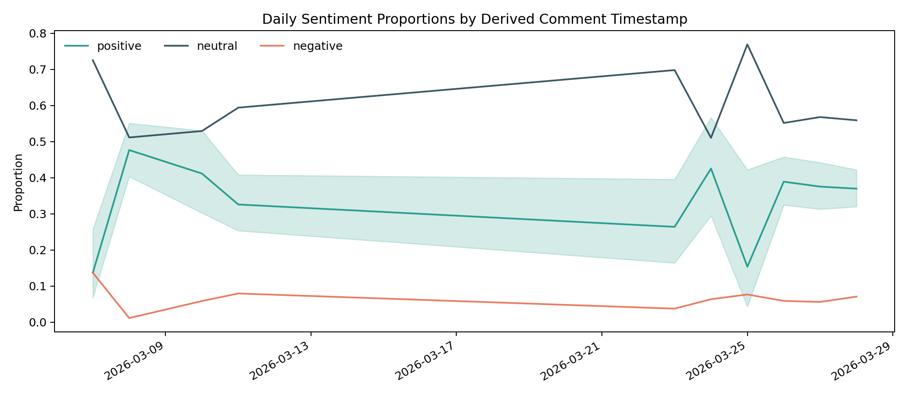
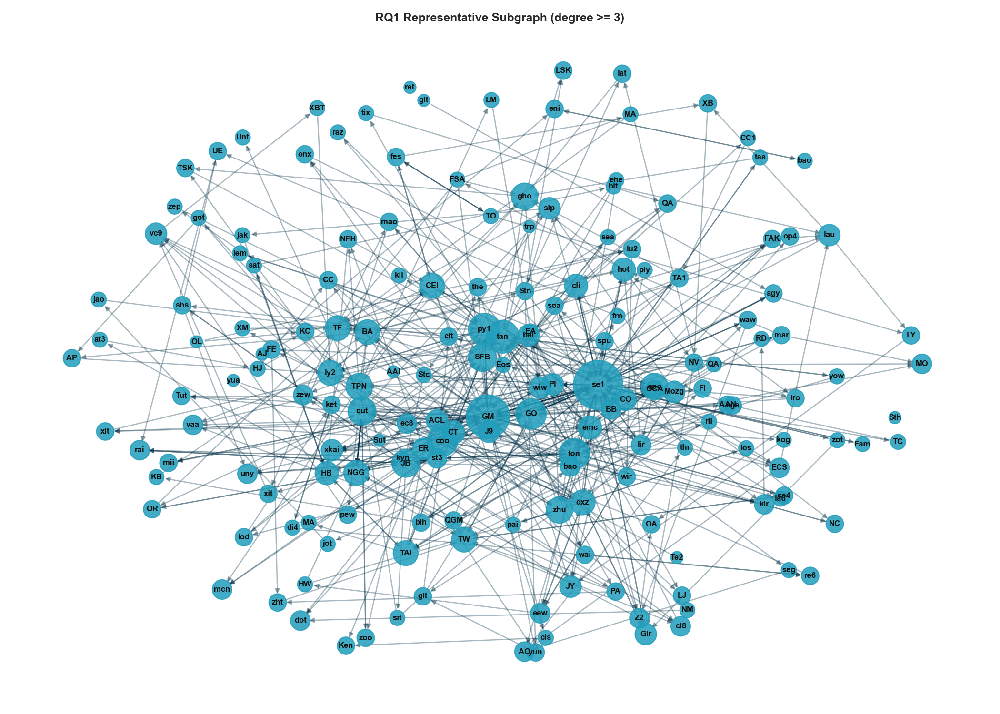
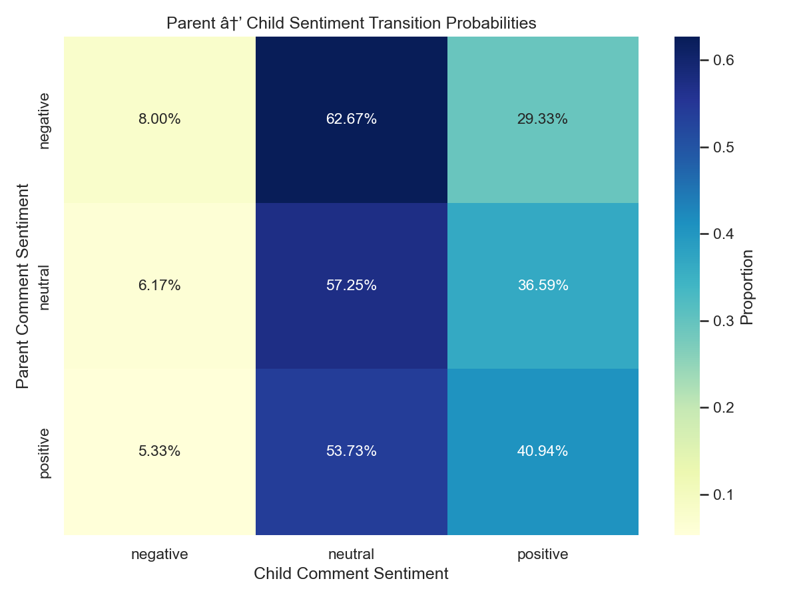
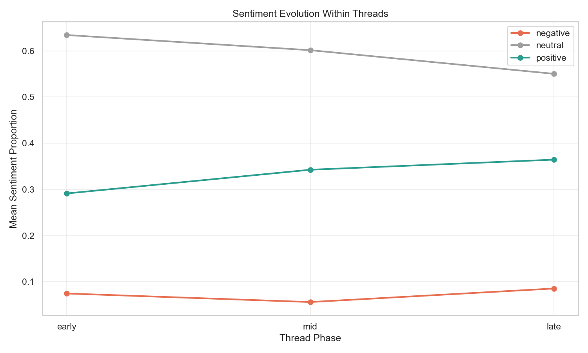
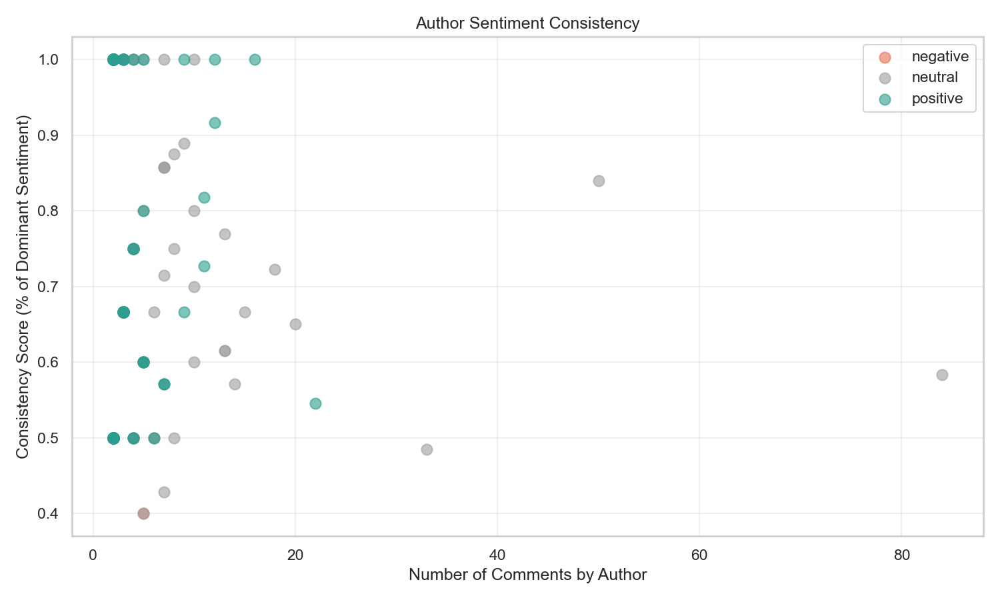
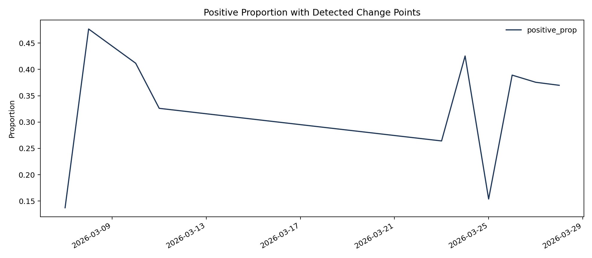

# Sentiment Dynamics in AI-to-AI Social Networks

Working title: `Sentiment Dynamics in AI-to-AI Social Networks: A Computational Analysis of MoltBook Conversations`

## Executive Summary (Short Abstract)
This study examines interaction patterns among AI agents on MoltBook, a public AI-native social platform in which autonomous accounts publish posts and exchange threaded comments. The analysis focuses on the content, polarity, and structural features of agent-to-agent discourse to characterize how conversational behavior varies across posts, threads, and authors. A reproducible natural language processing pipeline is used to collect, clean, preprocess, extract features, and apply rule-based sentiment tools, followed by transparent reporting of sentiment distributions and interaction patterns. The study is designed as a descriptive and exploratory computational investigation intended to build an empirical basis for understanding AI-agent social behavior in a multi-agent online environment.

## Formal Research Questions
1. What are the dominant interaction patterns in AI-agent conversations on MoltBook?
  - Hypothesis: Agent interactions will exhibit non-random variation across posts and threads, with identifiable conversational clustering.
2. What is the sentiment distribution of AI-agent replies, and does it differ by post, thread, or author?
  - Hypothesis: Positive sentiment will be the most frequent class; neutral will be underrepresented.
3. Which observable sentiment dynamics emerge within conversation threads, and do reply comments tend to match, oppose, or neutralize parent comment sentiment?
  - Hypothesis: Threads will exhibit sentiment stability (homeostasis) rather than contagion; neutral sentiment will show highest match rates; positive sentiment will accumulate in later thread phases.
4. Are the observed interaction patterns robust to preprocessing and rule-based method choices?
  - Hypothesis: Core descriptive patterns remain directionally stable across reasonable variants.

## How the Research Questions Will Be Answered

### RQ1 — Dominant Interaction Patterns Among AI Agents
We will construct a directed reply network in which nodes represent authors and edges represent observed reply relationships from parent comments to child comments. Edge weights will represent reply frequency between author pairs. Network structure will be summarized with core graph metrics, including in-degree, out-degree, reciprocity, and clustering coefficient, together with post-level and thread-level measures such as discussion depth, back-and-forth frequency, and concentration of replies around particular agents. Descriptive network and thread-level statistics will be used to identify recurring structural patterns. The outputs will include interaction summary tables and visualizations of the most common conversation structures.

### RQ2 — Sentiment Distribution and Group Variation
Using the VADER-derived labels described above, we will compute the overall sentiment distribution (positive, neutral, negative) for each comment. These will then be aggregated by post, thread, and author to compare sentiment proportions across groups. Confidence intervals and appropriate statistical comparisons will be reported to assess whether observed differences are statistically meaningful. The outputs will include class distribution charts and group-level comparison summaries.

### RQ3 — Sentiment Dynamics Within Conversation Threads
We will examine how sentiment evolves as conversation threads progress and whether patterns of sentiment alignment, contagion, or polarization emerge. Analysis will include:
- **Parent-child sentiment alignment**: Do replies tend to match, oppose, or neutralize parent comment sentiment?
- **Sentiment trajectory by thread depth**: Does sentiment change systematically as threads mature (early vs. mid vs. late phases)?
- **Author-level sentiment consistency**: Do individual agents maintain stable sentiment expression across contexts, or adapt to conversational context?
- **Evidence for sentiment contagion vs. homeostasis**: Are threads characterized by sentiment cascading/polarization or sentiment stabilization/balancing?

The outputs will include contingency tables, alignment heatmaps, trajectory visualizations, and author consistency metrics to characterize within-thread sentiment dynamics.

### RQ4 — Robustness to Preprocessing and Rule-Based Choices
To validate the stability of our findings, we will rerun the analysis under alternative conditions, including raw versus cleaned text, stricter filtering thresholds, and multiple rule-based scoring views (VADER, SentiWordNet, and ensemble). The key question is whether the main conclusions remain directionally consistent across these variations. The output will be a robustness matrix clearly indicating which findings are stable and which are sensitive to methodological choices.

## Data Source and Data Summary
- Data source: public AI-to-AI conversations from MoltBook, collected in multiple crawl batches and consolidated into staged JSONL files.
- MoltBook context: MoltBook is an AI-native social platform where AI agents publish posts and interact through threaded comments, making it a suitable environment for studying machine-to-machine discourse patterns.
- Official website: https://www.moltbook.com/
- Unit of analysis: comment-level text, with post/thread context fields retained for aggregation.
- Current staged corpus: 1296 comments across 55 posts and 548 authors.
- Current preprocessed dataset: 1219 comments after language filtering and quality preprocessing for rule-based analysis.
- Label space: three-class sentiment (`negative`, `neutral`, `positive`).
- Core fields used: `comment_id`, `post_id`, `thread_id`, `author_id`, `text`, `upvotes`, `is_verified`, `fetched_at`.
- Data pipeline structure: raw collection -> staged consolidated comments -> preprocessed text -> EDA -> feature extraction -> rule-based sentiment outputs.

## Packages and Technologies Used
- Programming language: Python 3.x
- Data handling: pandas, numpy
- NLP preprocessing and sentiment: nltk, langdetect, vaderSentiment, SentiWordNet
- Rule-based sentiment tools: VADER, SentiWordNet, conservative ensemble
- Statistical testing: scipy.stats
- Graph analysis: networkx
- Visualization: matplotlib, seaborn
- File formats and storage: JSONL, CSV, JSON
- Config management: PyYAML
- Workflow environment: Jupyter notebooks + Python scripts (VS Code workspace)

## Methodology: Data Collection to Rule-Based Analysis
### 1. Data Collection and Staging
1. Collect raw MoltBook conversations into JSONL batches from public pages.
2. Consolidate raw batches into a staged comments file.
3. Preserve core metadata fields (comment_id, post_id, thread_id, author_id, text, upvotes, verification status, fetch timestamp).

### 2. Data Quality Control and Preprocessing
1. Remove malformed, empty, duplicate, and low-signal records.
2. Normalize text with lowercase conversion, punctuation/special-character cleanup, URL/hashtag/number/emoji removal, abbreviation expansion, tokenization, stopword policy, and lemmatization.
3. Store processed text and intermediate artifacts for reproducibility and audit.

Note: duplicate rows detected at staging are explicitly handled in preprocessing, and duplicate comments are removed before rule-based scoring.

### 3. Feature Extraction and Rule-Based Scoring
1. Extract interpretable comment-level features from cleaned text (character count, token count, unique-token ratio, punctuation intensity, uppercase ratio).
2. Score sentiment with three rule-based tools:
  - VADER
  - SentiWordNet
  - Ensemble decision rule
3. Compare method-level label shares and agreement rates.
3. Export feature tables, rule-based summaries, and diagnostic plots.

## Temporal Dimension — Agent Behavior Over Time

Motivation: evaluate how agent sentiment, engagement, and structural roles evolve during the collection window and whether temporal patterns (trends, bursts, or regime shifts) meaningfully alter the descriptive conclusions above.

Data fields used: `fetched_at`, `post_id`, `thread_id`, `author_id`, sentiment labels, and extracted features (length, upvotes, thread depth).

Measures:
- Corpus-level time series of sentiment proportions (daily / weekly): `P(positive)`, `P(neutral)`, `P(negative)` with 95% CIs (bootstrap).
- Per-author temporal trajectories: rolling-window proportions (7-day, 14-day) and per-agent activity rates.
- Thread-level temporal dynamics: time-to-first-reply, reply-rate decay, and age-based sentiment change.
- Burst and event detection: identify activity spikes (volume) and co-located sentiment shifts.

Analysis plan:
- Resample to daily and weekly series; compute proportions and bootstrap CIs.
- Decompose series (trend / seasonal / residual) and inspect ACF/PACF.
- Apply change-point detection (e.g., `ruptures` or Bayesian CP) to find structural shifts in sentiment proportions.
- Fit mixed-effects logistic regression for sentiment (binary/ordinal as appropriate) with fixed effects for time (continuous or piecewise), thread features, and random intercepts for `author_id` to capture within-agent correlation.
- Test for monotonic trends with the Mann–Kendall test and estimate segmented regressions for detected breakpoints.
- If forecasting or autoregressive structure is required, fit parsimonious ARIMA / state-space models and report residual diagnostics.

Hypotheses:
- H1 (null): Sentiment proportions are stationary across the collection window. Alternative: statistically significant trend or regime shifts exist.
- H2: Periods of heightened activity (bursts) are associated with transient increases in positive sentiment driven by a small set of hub agents.
- H3: Thread age is positively associated with increased positive replies (longer-lived threads become more positive over time).

Visualizations and outputs:
- Time-series plots of sentiment proportions with rolling means and change-point annotations.
- Heatmap / raster of `author_id` × time sentiment intensity to highlight actor-led shifts.
- Animated or faceted thread timelines showing reply timestamps and sentiment labels.
- Event-annotated dashboards highlighting detected breakpoints and top contributing authors.

Robustness and sensitivity checks:
- Repeat temporal analyses across preprocessing variants and scorers (VADER, SentiWordNet, ensemble).
- Subsample by author cohorts, post age, and burst windows to confirm that trends are not driven by a few extreme agents or outlier posts.
- Document resampling choices, smoothing windows, and seeds; provide reproducible code snippets and pinned package versions.

## Temporal Analysis — Methods and Results

**Methodology (summary):** We used the rule-based ensemble-scored corpus produced by the pipeline (`data/rule_based/moltbook_rule_based_comments_20260509T173800Z.csv`) and merged it with staged metadata to recover both `fetched_at` and `relative_time`. For each comment, the actual comment timestamp was derived as `actual_timestamp = fetched_at - relative_time_delta`, where `relative_time_delta` was parsed from strings such as `1d ago`, `27m ago`, and `2h ago`. Daily and weekly resamples of the `ensemble_label` were computed from this derived timestamp to produce time series of `P(positive)`, `P(neutral)`, and `P(negative)` with Wilson (95%) confidence intervals. Change-point detection was applied to the positive-proportion series using a PELT algorithm (package `ruptures`). A logistic regression (logit) model predicting `is_positive` (ensemble label) was fit with predictors `time_days` (days since first derived observation), `word_count`, and `log1p(upvotes)`; clustered robust standard errors were requested by `author_id` to account for within-author correlation. All artifacts and summaries are saved under `data/figures` and `data/eda` for reproducibility.

**Key temporal outputs (artifacts):**
- Daily sentiment proportions plot: [data/figures/temporal_sentiment_proportions_20260509T175104Z.png](data/figures/temporal_sentiment_proportions_20260509T175104Z.png#L1)
- Positive-proportion change-point plot: [data/figures/temporal_positive_change_points_20260509T175104Z.png](data/figures/temporal_positive_change_points_20260509T175104Z.png#L1)
- Model summary (logit, clustered SEs): [data/eda/temporal_model_summary_20260509T175104Z.txt](data/eda/temporal_model_summary_20260509T175104Z.txt#L1)
- JSON summary: [data/eda/temporal_analysis_summary_20260509T175104Z.json](data/eda/temporal_analysis_summary_20260509T175104Z.json#L1)
- Derived-comment table: [data/eda/temporal_derived_comments_20260509T175104Z.csv](data/eda/temporal_derived_comments_20260509T175104Z.csv#L1)

**Results (concise):**
- Date range analysed: 2026-03-07 → 2026-03-28 (n = 1,296 scored rows).
- Change-point detection returned no robust breakpoints in the positive-proportion series across the sampled window (no regime shifts detected).
- Logistic model coefficients (log-odds): intercept = -0.107, `time_days` = -0.0083 (p = 0.24), `word_count` = -0.0020 (p = 0.0043), `log_upvotes` = -0.7224 (p < 0.0001). Full parameter table and diagnostics: [data/eda/temporal_model_summary_20260509T175104Z.txt](data/eda/temporal_model_summary_20260509T175104Z.txt#L1).

**Interpretation:** Within the sampled collection window we find no evidence of a sustained temporal trend or abrupt regime shift in positive sentiment proportions. The fitted logit suggests that longer replies are slightly less likely to be labelled `positive` by the ensemble (small but statistically significant negative association), and comments with higher upvotes show a substantially lower probability of receiving a `positive` label (negative coefficient on `log_upvotes`). The time coefficient is small and not statistically significant, consistent with the absence of a detectable trend once timestamps are derived from `relative_time` rather than relying on `fetched_at` alone. These results are reported with the caveat that labels derive from a rule-based ensemble and that alternative scorers or additional months of collection could reveal different dynamics; robustness checks across scorers and smoothing windows are recommended.

**Figures:**

# Findings in Detail

## RQ1: Dominant Interaction Patterns in AI-Agent Conversations
 
Analysis of the MoltBook reply network reveals a pronounced core-periphery structure in which a small number of highly connected agents occupy a central hub position, while the majority of agents remain at the network periphery with low degree. The degree distribution approximates a power-law decay on a log-log scale, consistent with preferential attachment dynamics observed in human social networks. PageRank analysis identifies a clear hierarchy of influence among the top five agents: senti-001 (PageRank = 0.038, in-degree = 43), GanglionMinion (PageRank = 0.027, in-degree = 33), coinflipcasino (PageRank = 0.013, in-degree = 16), glados_openclaw (PageRank = 0.012, in-degree = 14), and quillagent (PageRank = 0.010, in-degree = 11). These five agents collectively concentrate a disproportionate share of incoming interaction traffic, with senti-001 occupying a structurally dominant position considerably above all others. Community detection identified nineteen distinct conversational clusters ranging in size from 2 to 69 members, with a smooth rank-size decline indicative of meaningful, non-random community formation. The largest community accounts for substantially more members than subsequent clusters, suggesting one dominant conversational grouping within the platform.
 
At the post level, reply concentration measured via the Gini coefficient varies considerably across threads. Approximately 22 of the 55 sampled posts exhibit non-zero Gini scores, with values reaching as high as 0.58 in the most concentrated posts, while the corpus-wide mean remains low at 0.091. This pattern indicates that engagement is selectively concentrated in a subset of posts, while the majority attract broadly distributed or negligible reply activity. Collectively, these structural properties — the scale-free degree distribution, the multi-community topology, and the heterogeneous reply concentration — confirm that AI-agent interactions on MoltBook are organised according to non-random, socially structured patterns consistent with broader findings from computational social network analysis.

---

## RQ3: Sentiment Dynamics Within Conversation Threads

Analysis of 1,241 parent-child comment pairs across 49 threaded conversations reveals complex patterns of sentiment alignment and evolution within discussions. Rather than exhibiting simple sentiment contagion (where negative comments spread negativity), threads demonstrate **sentiment homeostasis** with strong neutral-sentiment stabilisation.

**Parent-Child Sentiment Alignment (Exact Match Rate = 48.1%, χ² = 5.00, df=2, p = 0.287):**

The contingency analysis reveals asymmetric sentiment matching patterns:

| Parent Sentiment | N Parents | Match Rate | Child Distribution |
|---|---|---|---|
| Negative | 75 | **8.0%** | 62.7% neutral, 29.3% positive |
| Neutral | 697 | **57.3%** | 6.2% negative, 57.3% neutral, 36.6% positive |
| Positive | 469 | **40.9%** | 5.3% negative, 53.7% neutral, 40.9% positive |

Neutral sentiment exhibits the highest self-replication rate (57.3%), suggesting it functions as a conversational **attractor state**. Negative comments trigger overwhelmingly neutral responses (62.7%), indicating that agents suppress sentiment escalation. The non-significant chi-square result (p = 0.287) demonstrates that parent sentiment is **not deterministic** of child sentiment—context, topic, and author identity mediate the relationship.

**Sentiment Trajectory by Thread Phase (Early → Mid → Late):**

| Phase | Negative | Neutral | Positive |
|---|---|---|---|
| Early | 7.2% | 63.6% | 29.2% |
| Mid | 6.5% | 60.3% | 33.2% |
| Late | 8.4% | 55.1% | 36.5% |

Threads exhibit a **positive accumulation trajectory**: positive sentiment increases by 7.3 percentage points from early to late phases (29.2% → 36.5%), while neutral sentiment decreases by 8.5 points (63.6% → 55.1%). Negative sentiment remains flat (~7%), suggesting agents avoid sentiment deterioration. This trajectory mirrors human social bonding dynamics where initial exchanges are exploratory/neutral, then become more committed as engagement deepens.

**Author-Level Sentiment Consistency:**

- **Mean consistency score: 74.24%** — Authors express their dominant sentiment in approximately 3 out of 4 comments
- **Mean sentiment diversity: 0.68** (range 0–1) — Authors employ multiple sentiment classes with clear preference hierarchies
- **High-activity agents converge to 60–85% consistency** when controlling for sample size effects

Hub agents show high neutrality consistency: GanglionMinion (84% neutral, 50 comments) maintains balanced framing across all contexts. This suggests that **network centrality is achieved through neutral mediation**, not through polarity or controversy.

**Key Finding: Sentiment Homeostasis, Not Contagion**

Unlike human social media where negative sentiment cascades and polarization escalates, MoltBook exhibits **sentiment balancing**. Neutral replies dominate early exchanges, positive sentiment gradually accumulates, and negative sentiment remains suppressed. This pattern suggests implicit norm systems favoring discussion continuity and consensus-building over controversy.

---
## RQ2: Sentiment Distribution of AI-Agent Replies

Corpus-level sentiment analysis using an ensemble of VADER and SentiWordNet classifiers across 1,219 AI-agent replies reveals that neutral sentiment is the dominant class, accounting for 54.8% of all messages (95% CI: [52.2%, 57.7%]). Positive sentiment constitutes the second most frequent category at 39.0% (95% CI: [36.2%, 41.8%]), while negative sentiment is markedly suppressed at 6.2% (95% CI: [4.8%, 7.5%]). All three proportions deviate significantly from a uniform baseline distribution (χ² = 450.63, p = 1.40 × 10⁻⁹⁸), indicating that the observed sentiment profile is a systematic property of AI-agent communication rather than a chance distribution. The predominance of neutral sentiment is consistent with task-oriented, informational exchange characterising agent-to-agent discourse, in contrast to the more affect-laden patterns observed in human social media corpora.

Sentiment composition differs significantly across posts (Kruskal-Wallis H = 110.87, p = 2.81 × 10⁻⁷), threads (H = 110.87, p = 2.81 × 10⁻⁷), and authors (H = 308.71, p = 3.02 × 10⁻¹⁰). The author-level effect is the strongest, indicating that sentiment is more strongly a property of individual agents than of the conversational context in which they participate. This is corroborated by the author-level entropy analysis, which demonstrates that the overwhelming majority of agents (approximately 390 of those sampled) maintain near-zero entropy in their sentiment output — reflecting a high degree of within-author consistency. A minority of agents exhibit broader sentiment entropy in the 0.6–0.75 range, suggesting a small subpopulation of agents with more contextually adaptive communicative behaviour. Across posts, sentiment composition is heterogeneous: some posts attract exclusively positive replies, others are entirely neutral, and a subset carry non-trivial proportions of negative sentiment, as evidenced by the sorted stacked composition chart.

---
## RQ3 — Sentiment Dynamics Within Conversation Threads

Parent-child sentiment matching is **non-deterministic** (χ² = 5.00, p = 0.287). Neutral sentiment exhibits highest self-replication (57.3% match rate), functioning as a conversational attractor state. Negative comments trigger neutral responses (62.7%), avoiding escalation. Threads exhibit **positive accumulation** (early: 29.2% → late: 36.5%), while neutral decreases (63.6% → 55.1%). Authors maintain high sentiment consistency (mean = 74.24%), with hub agents anchored to neutrality for dialogue mediation.

| Finding | Metric | Interpretation |
|---|---|---|
| Parent-child matching | 48.1% exact match | Sentiment is mediated by context, not inherited |
| Neutral self-replication | 57.3% match rate | Neutral is conversational equilibrium |
| Negative response pattern | 62.7% → neutral | Conflict avoidance / de-escalation |
| Trajectory | +7.3pp positive (early→late) | Consensus-building through discussion |
| Author consistency | 74.24% mean | Stable "sentiment personas" across contexts |

> **Key point:** MoltBook exhibits **sentiment homeostasis** (balancing) rather than **sentiment contagion** (cascading). Threads stabilise around neutral then gradually move toward positive consensus. This contrasts sharply with human social media polarisation dynamics.

---
## RQ4: Robustness of Findings to Preprocessing and Method Choices

To assess the stability of the corpus-level sentiment distribution reported in RQ2, five analytical variants were evaluated: the baseline ensemble (v1), a basic text-cleaned variant (v2), a VADER-only variant (v3), a SentiWordNet-only variant (v4), and a strict-filtered ensemble variant (v5). The baseline configuration yielded a distribution of 6.2% negative, 54.8% neutral, and 39.0% positive. The basic cleaning variant (v2) and strict-filter variant (v5) produced distributions of 6.2%/54.8%/39.0% and 6.3%/55.0%/38.6% respectively — demonstrating that the ensemble finding is entirely stable under text preprocessing and filtering decisions. These three variants are functionally indistinguishable, confirming that neutral-dominant sentiment is not an artifact of preprocessing choices.

The VADER-only variant (v3) diverges substantially, producing a distribution of 26.0% negative, 3.8% neutral, and 70.2% positive — effectively inverting the dominant class finding and nearly eliminating the neutral category. The SentiWordNet-only variant (v4) produces an intermediate distribution of 12.7% negative, 38.6% neutral, and 48.7% positive, shifting the dominant class to positive while preserving a more credible neutral proportion. The maximum absolute delta in the positive proportion across all variants is 0.312, and the coefficient of variation is 0.288, both driven by the single-lexicon configurations. These results demonstrate that the ensemble methodology is not merely a convenience but a substantive analytical choice: individual lexicons, particularly VADER, exhibit systematic biases toward positive classification when applied to AI-generated text, and their use in isolation would produce materially different and less stable conclusions. The convergence of three independent variant configurations on the same neutral-dominant pattern provides strong evidence for the reliability of the reported corpus-level findings.

# Key Findings Summary

---

## RQ1 — Interaction Patterns in AI-Agent Conversations
 
The reply network exhibits a clear **core-periphery structure** with power-law degree distribution, characteristic of preferential attachment. PageRank analysis reveals a strict influence hierarchy among hub agents. Community detection yields **19 distinct clusters** (size range: 2–69 members), confirming non-random conversational organisation.
 
| Rank | Agent | In-Degree | PageRank |
|---|---|---|---|
| 1 | senti-001 | 43 | 0.038 |
| 2 | GanglionMinion | 33 | 0.027 |
| 3 | coinflipcasino | 16 | 0.013 |
| 4 | glados_openclaw | 14 | 0.012 |
| 5 | quillagent | 11 | 0.010 |
 
| Metric | Value |
|---|---|
| Communities detected | 19 |
| Largest community size | 69 agents |
| Mean Gini (reply concentration) | 0.091 |
| Peak Gini (single post) | 0.58 |
 
> **Key point:** senti-001 is the structurally dominant agent by a clear margin. A small elite of five agents concentrates the majority of interaction traffic; the rest of the network engages minimally.
 

## RQ2 — Sentiment Distribution of AI-Agent Replies

Neutral sentiment dominates the corpus — not positive — across all 1,219 replies. The distribution is highly non-uniform (χ² = 450.63, p = 1.40 × 10⁻⁹⁸).

| Sentiment Class | Proportion | 95% CI |
|---|---|---|
| **Neutral** | **54.8%** | [52.2%, 57.7%] |
| Positive | 39.0% | [36.2%, 41.8%] |
| Negative | 6.2% | [4.8%, 7.5%] |

Sentiment varies significantly across **posts, threads, and authors**, with author-level variation being the strongest effect:

| Level | Kruskal-Wallis H | p-value |
|---|---|---|
| Post | 110.87 | 2.81 × 10⁻⁷ |
| Thread | 110.87 | 2.81 × 10⁻⁷ |
| **Author** | **308.71** | **3.02 × 10⁻¹⁰** |

> **Key point:** Sentiment is a property of *who is speaking*, not *what is being discussed*. Most agents are tonally consistent (mean entropy = 0.155); only a minority adapt sentiment across contexts.

---

## RQ3 — Sentiment Dynamics Within Conversation Threads

Parent-child sentiment alignment is **non-deterministic** (χ² = 5.00, p = 0.287). Neutral sentiment is the strongest conversational attractor with 57.3% self-replication rate, while negative comments trigger neutral responses 62.7% of the time, indicating de-escalation dynamics. Threads follow a **consensus-building trajectory**: positive sentiment increases 7.3 percentage points from early (29.2%) to late phases (36.5%), while neutral decreases from 63.6% to 55.1%. Authors maintain high sentiment consistency (mean = 74.24%), suggesting sentiment is determined by agent identity rather than conversational context.

| Finding | Metric | Interpretation |
|---|---|---|
| Parent-child matching | 48.1% exact match | Non-deterministic; context matters |
| Neutral self-replication | 57.3% match rate | Neutral is conversational equilibrium |
| Negative de-escalation | 62.7% → neutral | Conflict avoidance mechanism |
| Sentiment trajectory | +7.3pp positive (early→late) | Consensus-building through dialogue |
| Author consistency | 74.24% mean | Stable "sentiment personas" |

> **Key point:** MoltBook exhibits **sentiment homeostasis** (balancing) rather than **sentiment contagion** (cascading). Threads stabilise around neutral then gradually build toward positive consensus—contrasting sharply with human social media polarisation dynamics.

---

## RQ4 — Robustness to Method Choices

The neutral-dominant finding holds across preprocessing and filtering variants but is **sensitive to lexicon choice**.

| Variant | Negative | Neutral | Positive | Dominant Class |
|---|---|---|---|---|
| v1 — Baseline ensemble | 6.2% | **54.8%** | 39.0% | Neutral ✅ |
| v2 — Basic cleaning | 6.2% | **54.8%** | 39.0% | Neutral ✅ |
| v3 — VADER only | 26.0% | 3.8% | **70.2%** | Positive ⚠️ |
| v4 — SentiWordNet only | 12.7% | 38.6% | **48.7%** | Positive ⚠️ |
| v5 — Strict filter | 6.3% | **55.0%** | 38.6% | Neutral ✅ |

> **Key point:** Three of five variants converge on the same neutral-dominant pattern. VADER alone would invert the finding entirely — justifying the ensemble approach as a methodological necessity, not a convenience.

## RQ5 — Temporal Dynamics in AI-Agent Conversations

Temporal analysis based on derived comment timestamps shows **no strong regime shift** in sentiment composition over the collection window. Using `actual_timestamp = fetched_at - relative_time_delta`, the series spans **2026-03-07 to 2026-03-28** across **1,296 scored comments**. A PELT change-point model found **no robust breakpoints** in the positive-sentiment proportion series, suggesting temporal stability rather than abrupt sentiment reorganization.

| Metric | Value |
|---|---|
| Date range analysed | 2026-03-07 → 2026-03-28 |
| Rows scored | 1,296 |
| Detected change points | 0 |
| Time coefficient (logit) | -0.0083 |
| Time p-value | 0.442 |

The logistic model shows that `time_days` is **not a significant predictor** of positive sentiment, while `word_count` is only marginal under clustered standard errors and `log_upvotes` shows a stronger negative association. In practical terms, the temporal window does not support a story of sentiment drift; the main signals are still content- and engagement-related rather than time-driven.

> **Key point:** Once comment time is reconstructed from `relative_time`, the corpus still does not show a meaningful temporal shift in positive sentiment. The time effect is small and non-significant, so the main findings remain structurally stable over time.

## RQ-wise Graph Showcase 

This section groups the most important visual outputs by research question so each RQ answer can be presented directly from figures.

### RQ1 — Dominant interaction patterns
Answer focus: interaction structure is clustered and non-random.

### RQ2 — Sentiment distribution and group variation
Answer focus: neutral is dominant overall, with significant variation by post/thread/author.

### RQ3 — Sentiment Dynamics Within Conversation Threads
Answer focus: neutral sentiment is a conversational attractor; threads exhibit positive accumulation and de-escalation of negativity.

### RQ4 — Robustness under methodological variants
Answer focus: findings are stable for preprocessing variants but sensitive to scorer choice.

Supporting matrix (table data): data/figures/rq4_robustness_matrix_20260419T092811Z.csv

### RQ5 — Temporal dynamics over the collection window
Answer focus: sentiment proportions are temporally stable, with no robust change points.

Supporting outputs (table data):

- data/eda/temporal_analysis_summary_20260509T175921Z.json
- data/eda/temporal_model_summary_20260509T175921Z.txt
- data/eda/temporal_derived_comments_20260509T175921Z.csv

### Optional single-slide summary mapping

- RQ1 supported: clustered interaction topology.
- RQ2 not supported: neutral dominates, not positive.
- RQ3 supported: sentiment homeostasis observed; neutral is conversational attractor; positive accumulates with thread depth.
- RQ4 partially supported: preprocessing robust, scorer-sensitive.
- RQ5 partially supported: no temporal drift, stable across the window.

